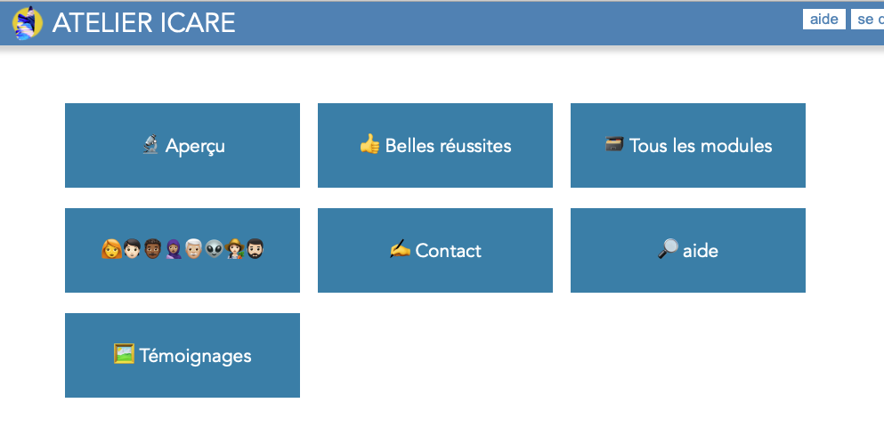
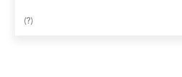
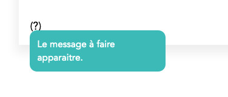
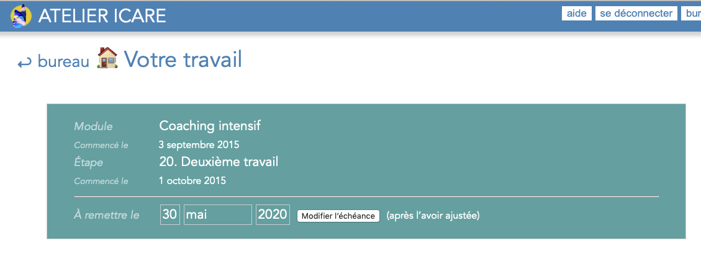

# ATELIER ICARE Manuel développeur

# Introduction

Il s’agit ici de la version produite en 2020 de l’Atelier Icare. Elle vise à simplifier le code au maximum.

# Principes fondateurs

* Tout ce qui est après le `/` du domaine et avant le `?` du query-string est appelé `route`. La route brute s’obtient par `Route.current.route`. On l’obtient grâce à `route.to_s` (qui retourne par exemple `bureau/home`. La seule modification faite est de transformer une chaine vide en `home`.
* Quand une route est définie (par exemple `section/page`) la première chose que fait le programme de construction de la page est de voir si le dossier `./_lib/pages/section/page` existe. Si c’est le cas, on le charge entièrement, c’est-à-dire le ruby, le css et le javascript. C’est donc dans `_lib/pages/` principalement qu’on va trouver la définition des pages et c’est vraiment dans ce dossier qu’il faut s’arranger pour tout mettre.
* Si un module ruby de la page ci-dessus définit la méthode `HTML#exec`, cette méthode est appelée avant la fabrication de la page. Cela permet par exemple de traiter les formulaires.
* Les pages ci-dessus surclassent les méthodes générale `HTML#build_header` etc. et en tout premier lieu la méthode générale **`HTML#build_body`** qui construit le corps de la page.
* Dès qu’un dossier contient des fichiers `.css` ou `.js`, ils sont automatiquement chargés par la méthode générale `require_module`. « Chargés » signifie que leur balise est insérée dans la page.
* Charger vraiment le minimum de code pour toute section. Donc utilisation intensive de la méthode `require_module` qui va charger à la volée des modules depuis le dossier `./_lib/modules/`.

---

## Les quatre dossiers principaux

Les trois dossiers où il faut chercher les choses sont :

### _lib/pages/

C’est là où sont définies toutes les routes. Si on appelle l’url `bureau/home`, c’est le dossier `./lib/pages/bureau/home/` qu’on chargera et qui contiendra tous les éléments (HTML, CSS et Javascript) propres à cette route.

### _lib/required/

Contient tous les codes chargés chaque fois. 

Définit notamment les grandes classes que sont `User` (pour gérer l’utilisateur) ou `HTML` pour la construction de la page à afficher.

Définit aussi toutes les extensions de classe.

Les éléments notables de ce dossier :

* **`constants/`**. Dossier qui définit les constantes générales, String, Path, etc.
* **`Tag.rb`** qui permet de construire facilement toutes les balises (tags) HTML. 

### \_lib/\_watchers_processus\_/

Contient la définition de tous les watchers, tous les processus de watcher.

Noter que ce n’est pas dans ce dossier que se trouve la définition des classes `Watcher` et `Watchers` dans dans le dossier des modules.

### \_lib/modules/

Contient tous les modules propres qui permettent la gestion ponctuelle d'éléments. Ces modules sont pensés pour ne pas avoir à tout charger chaque fois. Par exemple, on ne charge le module `absmodules` — qui permet de travailler avec les modules d'apprentissage absolus — que lorsqu'on en a besoin, pour le bureau de travail de l'icarien par exemple.

> Note : on charge n'importe quel dossier de ce dossier grâce à la méthode pratique `require_module(<nom du dossier>)`.

---

## Création d’une nouvelle route/page

Commencer par lire les [principes fondateurs](#principes) du nouveau site.

Le plus simple est d’utiliser la ligne de commande :

~~~bash
> icare create route
~~~

> Note : la suite est assistée.

Pour voir **comment écrire la page** (son texte, son contenu), rejoindre la section [Construction des pages](#constructionpages).

Grâce à l’assistant en ligne de commande `> icare create route`, on va pouvoir créer le dossier de la nouvelle route dans `./_lib/pages/`. Par exemple, si la route est `user/pourvoir`,  on doit créer le dossier `./_lib/pages/user/pourvoir/`. Ce dossier sera  appelé **dossier de la route** dans la suite.

**Attention** : une route ne doit pas être créée dans une autre, puisque tout le dossier d’une route est entièrement chargé, ruby, css, javascript quand elle est appelée (donc le dossier de l’autre route à l’intérieur serait lui aussi chargé…).

Créer dans ce *dossier de la route*  un fichier `html.rb` (ou autre nom, peu importe) qui contienne :

~~~ruby
class HTML

  def titre
    "Le titre de la page"
  end

  def exec
    ... code à exécuter avant la construction de la page ...
  end

  # Construction du body (section#content)
  def build_body
	  # Mettre ici le code de construction du body de la page
    @body = <<-HTML
			... body de la page ...
		HTML
	end
end
~~~

Ajouter dans ce dossier les `.css` et les `.js` qui lui sont nécessaires et qui lui sont propres.

Ajouter les vues `ERB` ou `Markdown` qui peuvent servir à construire l’intégralité du body ou une partie seulement. Cf. [Utilisation des vues ERB](#useerbviews).

### Méthode `exec` à appeler

Comme on peut le voir ci-dessus, la méthode `html#exec` permet d’exécuter un code avant de construire la page. C’est ici, par exemple, qu’on vérifie les valeurs d’identification et qu’on authentifie — ou non — l’utilisateur, etc.

~~~ruby
class HTML
  def exec
    ... code à exécuter avant la fabrication de la page ...
  end
end
~~~

### Les dossiers `xrequired`

Le chargement des routes respecte le [principe des xrequired][].

---

## Principes

### Principe des xrequired

Le « principe des xrequired » signifie que lorsqu’on charge un dossier (à l’aide de la méthode `require_module` ou `Page.load`), tous les dossiers `xrequired` se trouvant sur la hiérarchie sont automatiquement chargés. Cela permet d’hériter de méthodes supérieures. Pour les [watchers](#leswatchers), cela permet d’hériter des méthodes utiles lorsqu’un watcher est actionné.

Par exemple, si la route à atteindre est `admin/icariens/outils`, cela fait appel à un dossier se trouvant dans :

~~~
LIB/pages/admin/icariens/outils/
~~~

> Pour la suite, le dossier `lib` étant amené à changer de nom, j’utiliserai `LIB` pour le désigner.

En appelant cette route, l’application cherche donc à charger les dossiers suivants :

~~~
LIB/pages/admin/icariens/outils/xrequired
LIB/pages/admin/icariens/xrequired
LIB/pages/admin/xrequired
~~~

Cela, on le comprend, permet donc de partager des méthodes et des modules dans un même lieu.

> Note : pour les routes, c’est le module [`./_lib/_classes/page.rb` ](/Users/philippeperret/Sites/AlwaysData/Icare_2020/_lib/required/_classes/page.rb) qui s’en charge avec la méthode `load_xrequired`. Pour les modules, c’est la méthode `load_xrequired_on_hierarchy` du module [./_lib/required/__first/require_methods.rb](/Users/philippeperret/Sites/AlwaysData/Icare_2020/_lib/required/__first/require_methods.rb).

---

## Paramètres URL

#### Obtenir la valeur d’un paramètre

Pour obtenir un paramètre passé par l'URL, on utilise la méthode :

~~~ruby
param(:<key>)							param(:op)
# => valeur de :<key>			# => retourne la valeur de &op=...
~~~

> Note : on peut utiliser indifféremment un String ou un Symbol comme clé, mais elle sera toujours transformée en `Symbol` dans les paramètres.

#### (Re)définir la valeur d'un paramètre

On peut définir ou redéfinir ce paramètre à la volée en cours de programme, à l’aide d’un second argument :

~~~ruby
param(:<key>, <new value>)								param(:op, "nouvelle-operation")
# Met la valeur de :<key> à <new value>		# Met :op à "nouvelle-operation"

# Si la clé est inexistante, cela la crée, ce qui permet de passer des valeurs à
# travers tout le programme.
~~~

> Noter que ce changement est « définitif ». La valeur initiale sera supprimée. Mais on peut définir un nouveau paramètres en prenant garde des collisions de nom :
>
> ~~~ruby
> param(:old_op, param(:op))
> param(:op, "nouvelle opération")
> ~~~
>
>

---

## Requérir des modules à la volée

Requérir des modules à la volée permet de ne charger que le code nécessaire à une section. C’est un principe fondateur du nouvel atelier.

On les charge à l’aide des méthodes :

~~~ruby
require_module('nom-module')

require_modules(['module1', 'module2', ..., 'moduleN'])
~~~

Requérir un module signifie :

* requérir tous ses fichiers ruby (`.rb`), dans son dossier ou ses sous-dossiers,
* charger les feuilles de styles (`.css`) de son dossier et ses sous-dossiers,
* charger les javascripts (`.js`) de son dossier et tous ses sous-dossiers,
* requérir tous les éléments des dossiers `xrequired` de ses ascendants selon le [principe des xrequired][].

Ces modules doivent se trouver dans le dossier :

~~~bash
LIB/modules/
~~~

---

##  Les icariens

Les icariens et les icariennes sont des `User`s. 

Le visiteur courant est toujours accessible dans le programme par `user`.

> Note : il ne faut donc jamais utiliser ce nom comme variable. Préférer `_user` ou même `icarien`.

Quand c'est l'icarien d'une autre classe, on emploie la propriété `owner` pour le désigner.

> Note : il ne faut donc jamais utiliser ce nom comme variable.

Un visiteur non identifié répond positivement à `user.guest?`. 

### Options des icariens

| Bit (0-start) | Description                                                  |
| ------------- | ------------------------------------------------------------ |
| 0             | > 0 => administrateur du site.   > 1 => super administrateur (moi) |
| 1             | Bit de grade                                                 |
| 2             | 1: le mail a été confirmé                                    |
| 3             | 1 si l’icarien a été détruit. Note : toutes ses « productions » sur le site devient anonymes (`user_id` = 9). |
| 4             | Bit de fréquence de mail 0: quotidien, 1:hebdomadaire, 9: aucun mail |
| 5             |                                                              |
| 6             |                                                              |
| 7             |                                                              |
| 8             |                                                              |
| 9             |                                                              |
| 10            |                                                              |
| 11            |                                                              |
| 12            |                                                              |
| 13            |                                                              |
| 14            |                                                              |
| 15            |                                                              |
| 16            | **Bit de statut** (ou d’activité) 0, 1: invité (visiteur non identifié), 3: en pause, 4: inactif |
| 17            | **Bit de non contact par mail** Si 1, l’icarien ne veut pas être contacté. |
| 18            | **Bit de redirection** Détermine la section à rejoindre après l’identification. |
| 19            | **Bit de contact** Détermine comment l’icarien veut pouvoir être  contacté. 9: strictement aucun contact. |
| 20            | **Bit d'entête** 1: l’entête du site doit être cachée (inusité dans la version actuelle) |
| 21            | **Bit d’historique partagé** Si 1, l’icarien partage avec les autres icariens son historique de travail. |
| 22            | **Bit de notification de message** Si 1, l’icarien est averti par mail lorsque quelqu’un lui laisse un message sur son frigo. |
| 23            | **Bit de contact avec le monde** (toute personne hors atelier) 9: aucun contact |
| 24            | **Bit de « réalité »**. Il est à 1 si c’est un « vrai » icarien, c’est-à-dire si c’est un icarien qui a déjà effectué un paiement. |
| 25            |                                                              |
| 26            |                                                              |
| 27            |                                                              |
| 28            |                                                              |
| 29            |                                                              |
| 30            |                                                              |
| 31            |                                                              |

### Envoi d'un mail à un icarien

~~~ruby
<user>.send_mail(subject:"Le sujet", message:"
le message HTML
")
~~~

---

## Base de données

Les requêtes sont toutes exécutées soit sur la base `icare` ou sur la base `icare_test` (en mode de test et sandbox).

### Exécution d’une requête quelconque (`db_exec`)

La méthode la plus « simple » d’utilisation est la méthode `db_exec` qui exécute la requête qui lui est fournie en premier argument :

~~~ruby
db_exec("SELECT * FROM icdocuments FROM user_id = 12 LIMIT 12 ORDER BY original_name")
# => retourne la liste de toutes les données des documents de l'user #12, dans une
#    limite de 12 documents, en les classant par le nom original.
~~~

### Nombre d’éléments d’une table (`db_count`)

La méthode `db_count` retourne le nombre d’élément d’un table, en respectant ou non un filtre :

~~~ruby
db_count("<table>"[, {filtre}])
# Retourne le nombre d'éléments de <table> qui respectent le filtre {filtre}
~~~

> Le `filtre` peut-être un string qui correspond à la clause WHERE (sans « where »).

### Création simplifiée d’une nouvelle donnée (`db_compose_insert`)

La méthode `db_compose_insert` permet de composer facilement une nouvelle données à créer.

La commande :

~~~ruby
db_compose_insert('table', {<data>})
~~~

… va produire la même chose que :

~~~ruby
valeurs.merge!(updated_at: Time.now.to_i, created_at:Time.now.to_i)
valeurs = data.values
columns = data.keys.join(VG)
interro = Array.new(valeurs.count,'?').join(VG)
request = "INSERT INTO #{table} (#{columns}) VALUES (#{interro})"
db_exec(request, valeurs)
~~~

### Actualisation simplifiée d’une donnée (`db_compose_update`)

La méthode `db_compose_update` permet de composer facilement une donnée à actualiser.

La commande :

~~~ruby
db_compose_update('<table>', <id>, <data>)
~~~

… va produire la même chose que :

~~~ruby
data.merge!(updated_at: Time.now.to_i)
valeurs = data.values << id
columns = data.keys.collect{|c|"c = ?"}.join(VG)
request = "INSERT <table> SET #{columns} WHERE id = ?"
db_exec(request, valeurs)
~~~

---

## Messagerie

Pour les messages, on peut utiliser les méthodes suivantes :

### `message("...")` ou `notice("...")`

Pour un message d’information.

### `erreur("...")`

Pour un message d’erreur.

### `log("... »)`, `log(<error>)`, `log({hash})`

Pour un message dans le journal de suivi. Comme le titre l’indique, on peut envoyer indifféremment un string, une erreur ou une table.

### Constantes de messages

On peut trouver dans le fichier `./_lib/required/__first/constants/errors.rb` des constantes de messages d’erreur qui peuvent être appelés par `ERRORS[:<key>]`. On peut trouver de la même manière des messages notice par `MESSAGES[:<key>]`.

Certains messages peuvent même comporter des variables qu’on modifie par :

~~~ruby
erreur( ERRORS[:message_variable] % {var:'première', var2:'deuxième'})

# ou

erreur( ERRORS[:message_vars] % ['première', 'deuxième'])

# Avec :

ERRORS = {
  ...
  message_variable: "Mon %{var} et %{var2}.",
  message_vars: "Mon %s et %s."
 }
~~~

### Envoi des erreurs à l'administration

Pour pouvoir signaler (par mail) des erreurs à l'administration, on utilise la méthode :

~~~ruby

send_error("<message d'erreur>"[, {<data>}])
# => Produit un mail qui m'est envoyé

~~~

---

## Construction des pages, helpers

> Note : on peut créer les dossiers et fichier des nouvelles routes de façon assistée grâce
> ~~~bash
> > icare create route
> ~~~

### Format des fichiers des pages

Construire une page consiste à définir la variable `html#body` (`@body`) qui va être insérée dans la page, aisni que le titre.

Une page peut être au format `ERB` ou au format `Markdown` (étendu). Les deux formats permettent l'utilisation des variables :

* `<%= variable|méthode %>` pour le format `ERB`,
* `#{variable|méthode}` pour le format `Markdown`.

Si un code compliqué (if, etc.) doit être utilisé dans le format `Markdown`, il doit impérativement être mis sur une seule ligne. Sinon, privilégier le format `ERB`.

Noter qu’on peut se servir des méthodes pour mettre en forme. Par exemple, dans un fichier Markdown, on peut utiliser la méthode d'helper générale `par` pour centrer un paragraphe :

~~~markdown

#{par("Ceci est un paragraphe centré", :center)}

<!-- version DIV -->

#{div("Ceci est un div centré", :center)}
~~~

### Traitement en fonction du format

On peut traiter un code indifféremment en ERB ou en MARKDOWN grâce à la méthode :

~~~ruby

deserb_or_markdown("<code erb ou markdown>"[, objet_a_binder])

~~~

> Noter que le code est "safé" dans la méthode, donc il est inutile de forcer son encodage avant.

### Traitement spécial / Mises en forme spéciales

La méthode [`String#special_formating`](/Users/philippeperret/Sites/AlwaysData/Icare_2020/_lib/required/__first/extensions/String_special_formating.rb) permet d’exécuter les dernières mises en forme sur les textes propres à l’atelier Icare.

Cette méthode est appliquée à la fin des méthodes `deserb`, `kramdown` et `deserb_or_kramdown`. Pour ne pas l’appliquer — c’est nécessaire parfois, lorsqu’on doit éditer du code, par exemple, comme les étapes de modules —, il faut mettre dans le troisième argument — les options — la propriété `formate: false` :

~~~ruby
str = deserb_or_kramdown('# Mon code', <binder>, {formate: false})
# => produit un code sans formatage spécial.
~~~

#### Mises en forme spéciales

Les mises en forme traitées, principalement utilisées dans les pages d’étape, sont :

Toutes ces mises en forme commencent par `<!`. Si elles encadrent du texte, elles terminent par `<!/` avec la même suite. Par exemple `<!div.mondivspécial>` et `<!/div.mondivspécial>`.

**Illustration de document**

~~~
<!div.document>
...
... une illustration de document
... traitée comme du code markdown
... le premier niveau de titre commence à #
...
<!/div.document>
~~~

### Titre de la page

Le titre de la page est défini par la méthode `HTML#titre`.

Quand le titre doit être « détaché » du bandeau de log et du contenu de la page — comme cela arrive avec le hall of fame par exemple, on peut utiliser la constante `DIV_AIR` pour ajouter de l’air.

Par exemple :

~~~ruby
class HTML
  def titre
    @titre ||= "#{DIV_AIR}Mon beau titre#{DIV_AIR}".freeze
  end
  ...
end #/HTML
~~~

### Méthodes d'helpers générales

Le module `LIB/required/__start/helpers/string_helpers_module.rb` qui définit le module `StringHelpersMethods` permet d'ajouter les méthodes d'helpers générales à toutes les classes qui en ont besoin.

**Une classe héritant de `ContainerClass` hérite aussi de ces méthodes**. Il n’y a donc rien à faire.

cf. le [module des strings helpers](/Users/philippeperret/Sites/AlwaysData/Icare_2020/_lib/required/__first/helpers/string_helpers_module.rb).

Pour pouvoir utiliser/avoir accès à ces méthodes n’importe où, on utilise :

~~~ruby

	StringHelper#<methode>

	# Par exemple :

	StringHelper.politique_confidentialite

~~~

Extraits de méthodes :

~~~
mot(mot_id, le_mot)			Produit un lien vers un mot du scénodico
page(page_id, titre)		Produit un lien vers une page de la collection narration
~~~

### Méthodes de formatage pratiques

On trouve dans le module [\_lib/required/\_\_first/extensions/Formate\_helpers.rb](/Users/philippeperret/Sites/AlwaysData/Icare_2020/_lib/required/__first/extensions/Formate_helpers.rb) des méthodes pratiques comme la méthode `formate_date(...)` qui permet d'obtenir facilement une date humaine du moment présent (sans argument) ou d'un temps/date donné en argument.

~~~ruby
formate_date()
# => Retourne le temps courant comme : "19 juin 2020"

formate_date(time)
# => Retourne le temps +time+ comme : "17 juillet 2020"

formate_date(time, {mois: :court})
# => "17 juil 2020"

formate_date(time, {duree: true})
# => "17 juillet 2020 (dans 29 jours)"

formate_date(nil, {hour: true}) # ou time:true
# => "19 juin 2020 10:37"
~~~

### Caractères spéciaux

#### Tiret de liste (« –␣ »)

Pour obtenir un tiret de liste qui laisse vraiment le même espace entre le tiret et le texte malgré la justification, on utiliser `#{TIRET}Le texte`.

~~~

#{TIRET}C'est le premier item de liste.

#{TIRET}C'est le deuxième item de liste. Ils devraient tous être
plus long pour voir comment est réparti l'espace.

#{TIRET}Un troisième item de liste.

~~~

### Constantes LIENS fréquents

#### Liens de retour (pour revenir à une partir principale)

~~~ruby
RETOUR_BUREAU		# Pour retourner au bureau (avec le signe ↩︎ devant)
RETOUR_PROFIL		# Pour retourner au profil (avec le signe ↩︎ devant)
~~~

### Contenu de la page

Le plus simple est d’écrire le contenu, le texte, dans le fichier `body.erb` ou `body.md` qui peut se trouver à la racine du dossier, et sera  appelé par :

~~~ruby
# Format ERB
class HTML
	...
	def body
		@body = deserb('body', <owner>)
	end
	...
end #/HTML
~~~

~~~ruby
# Format Markdown
class HTML
	...
	def body
		@body = kramdown('body', <owner>)
	end
	...
end #/HTML
~~~

De nombreux helpers aident ensuite à rédiger les pages avec plus de facilités.

On peut citer notamment ces méthodes et classes indispensables.

* La classe **Tag** qui permet de produire toutes les balises nécessaires (cf. ci-dessous).
* La méthode générique **Tag.lien(…)** qui permet de produire facilement un lien.
* La méthode **Tag.aide(id)** qui permet de générer un lien vers un fichier d’aide (voir [Aide](#laide).
* La méthode **Tag.info_bulle(...)** qui permet de mettre une info-bulle sur un mot.
* La méthode **formate_date(time)** qui permet de mettre en forme une date.

### `Tag`, builder de balises

La classe `Tag`, définies dans [./_lib/required/__first/helpers/Tags.rb](/Users/philippeperret/Sites/AlwaysData/Icare_2020/_lib/required/__first/helpers/Tags.rb), permet de créer très facilement des liens à l’aide de la méthode :

~~~ruby
Tag.<type tage>({<params>})
~~~

Par exemple :

~~~ruby
lien = Tag.link({route:"ma/route", titre:"Suivre ma route", class:'class-du-lien'})
~~~

Voir dans le fichier ci-dessus toutes les méthodes utilisables.

#### Lien vers le bureau

~~~ruby
Tag.lien_bureau([titre])
# Note : il vaut mieux ne pas utiliser `[titre]` pour avoir un picto avec "Bureau"
~~~

#### Lien vers des routes connues

On peut obtenir des liens vers des routes connues grâce à la méthode `Tag.route`, en passant en premier argument soit un raccourci de route (par exemple `:aide` pour l’aide) soit une route explicite.

Les raccourcis de route sont définis dans le fichier [./_lib/required/__first/constants/routes.rb](/Users/philippeperret/Sites/AlwaysData/Icare_2020/_lib/required/__first/constants/routes.rb).

On utilise alors :

~~~ruby
Tag.route(:<route id>[, "titre", {options}])
~~~

> Dans `options`, on peut par exemple indiquer `full: true` pour créer un URL entière qui pourra être utilisée dans les mails.
>
> Noter que c’est le cas, de manière générale, avec toutes les méthodes générant des liens, à commencer par `Tag.lien`.

#### Lien « retour » pour titre

Pour définir un lien à ajouter au titre des pages, ressemblant à :

… on utilise la méthode :

~~~ruby
Tag.retour(:route, :titre)
# Les deux arguments sont obligatoire
~~~

### Blocs particuliers

Plusieurs méthodes permettent de produire rapidement du code, lorsqu’il est fréquent. C’est le cas des méthodes suivantes.

> De manière générale, on trouve les méthodes helpers dans le dossier `./lib/required/__first/handies` mais il faut comprendre aussi que des méthodes particulières sont définies dans les modules (par exemple les helpers pour les formulaires, dans le module 'forms').

#### Les div boutons (buttons)

~~~ruby

~~~

Ils sont toujours formatés en respectant les règles suivantes :

* ils ont le fer à droite,
* ils laissent de l’air au-dessus de leur tête,
* traitent tous les liens `<a>` comme des boutons (class `btn`),
* traitent tous les liens `<a class="main">` comme des boutons principaux.

#### Les "divRow"

La méthode d'helper `divRow(...)` permet de construire une rangée avec un élément à gauche — en général le libellé, en premier argument — et un élément à droite — en général la valeur, en deuxième argument. Le troisième argument permet de passer des options qui permettent d'affiner l'affichage.

~~~ruby
divRow("mon libellé à gauche", "Ma valeur à droite"[, {<options>}])
# => Produit un div.row-flex
~~~

~~~ruby
options = {
	libelle_size:		Integer, 	# largeur en pixel du libellé
	value_size:			Integer, 	# largeur en pixel du span valeur
	class:					String		# la class CSS à ajouter au div principal
}
~~~

#### Les blocs « GoTo »

~~~ruby
divGoto("... inner ...")
~~~

Pour écrire un lien dans un « bloc » comme ceux qu’on peut trouver sur la page de plan ou sur les accueils de bureau.

Quand il y en a plusieurs et qu’on veut en mettre en exergue, on peut ajouter la classe `exergue` de cette façon :

~~~html

  ... le contenu ...

~~~

Avec la méthode divGoto :

~~~ruby
div = divGoto('<inner>', exergue: true)
~~~

#### Les info-bulles

Les « info-bulles » permettent de faire apparaitre du texte d’aide au survol d’un élément, en général un point d’interrogation grisé.

On les obtient à l’aide de :

~~~ruby
Tag.info_bulle("Le message à faire apparaitre.")
~~~

| Mouse out                     | Mouse over                     |
| ----------------------------- | ------------------------------ |
|  |  |

On peut également mettre un message bulle sur un texte à l’aide du code suivant :

~~~erb
C'est du texte avec un mot qui porte <%= Tag.info_bulle("Le message à faire apparaitre en survolant le mot", {text: "une info-bulle"}) %> qui devrait apparaitre au survol de la souris et disparaitre ensuite.
~~~

Les données peuvent être fournies « à l’envers »  (pour une lecture plus facile) :

~~~erb
C'est du texte avec un mot qui porte <%= Tag.info_bulle("une info-bulle", {aide: "Le message à faire apparaitre en survolant le mot"}) %> qui devrait apparaitre au survol de la souris et disparaitre ensuite.
~~~

Ce qui va produire :

#### Les « listes d'état » (StateList)

~~~ruby
StateList.row("libelle", value[, {options}])
~~~

Génère une rangée de type « Statelist » comme on peut en trouver sur la page du travail courant pour afficher l’état du module (nom, échéance)

**NOTE** : pour que ces rangées s’affichent correctement, il faut entourer le code généré par un  `div.state-list` (ou un `div.state-list.vert` pour un fond vert comme ci-dessus) :

~~~erb

  <%= StateList.row("Mon libellé", "Ma valeur", {class:'small'})

~~~

> Comme on peut le voir ci-dessus, on peut ajouter un troisième argument qui contiendra des options d’affichage, comme ici la classe à appliquer à la rangée.

Pour **différentes largeurs de libellés**, on peut utiliser les classes `medium` (libellé de taille moyenne) et `large` (libellé large).

Si l’on préfère que les libellés soient **alignés à gauche**, on ajoute la classe `left`.

Ainsi, si on veut une liste avec large libellé alignés à gauche, on utilise :

~~~html

  <%= StateList.row("Mon libellé plus large fer à gauche", "une valeur") %>

~~~

##### Bouton pour modifier les données de la StateList

Si les données contenues dans la **StateList** sont modifiables, on peut ajouter un bouton (crayon pour le moment) qui permet de se rendre au formulaire de modification :

~~~erb

	#{StateList.button_modify('<route>'[, {options}])}
  ...

~~~

Dans les `{options}`, on peut définir une `:class` supplémentaire ou un `:title` qui apparaitra quand on glisse la souris sur le bouton.

## Styles particuliers

### Outils discrets

Les outils discrets sont des boutons qui ont une faible opacité et qui s’affiche normalement lorsque l’on glisse la souris dessus. Ils sont obtenus à l’aide de la classe CSS `discret-tool`.

~~~html

  <button>Mon bouton</button>
  <a href="#justeque">Pour voir</a>

~~~

---

## Formulaires

Les formulaires peuvent être facilement créés grâce à la classe `Form`.

Pour instancier le formulaire, il lui suffit d’un identifiant et d’un action (ou d’une route) pour le traitement.

~~~ruby
form = Form.new({id:'...', route:'...', size: ...})
~~~

Par exemple :

~~~ruby
require_module('form')
form = Form.new(id:'login-form', route:'user/login', size: 300)
# => Instance du formulaire
~~~

**Propriétés obligatoires**

~~~ruby
{
  id: 'identifiant du formulaire',
  route: 'route/pour/la/soumission'
 }
~~~

**Propriétés optionnelles** définissables :

~~~ruby
{
  size: 800, 					# largeur totale du formulaire
	class: 'classCSS'		# Class CSS du formulaire  
  										# Par exemple 'noborder' pour retirer le cadre du formulaire
}
~~~

On peut définir ensuite les rangées par :

~~~ruby
form.rows = {
  '<Label prop>' => {... définition de la rangée ...},
  '<Label prop>' => {... définition de la rangée ...},
  ...
 }
~~~

Par exemple :

~~~ruby
form.rows = {
  "Votre pseudo" => {name:'user_pseudo', type:'text', value: "Phil"}
  }
~~~

> Note 1 : la propriété `:name` est absolument requise.
>
> Ntoe 2 : la propriété `type` est 'text' par défaut.
>
> Note 3 : la propriété `:value` peut être remplacée par `:default`.

### Types de champ

~~~
text					Pour un input text simple
textarea			Pour un champ textarea
password			Pour un mot de passe
select				Pour un menu select. Les valeurs doivent être fournies par :values
checkbox			Une case à cocher
file					Pour choisir un fichier
raw						Pour un code qui sera inséré tel quel (par exemple une liste de cbs). On 
							renseigne alors la propriété :content, :value ou :name avec le contenu.
titre					Un titre (le label est le titre)
explication		Une explication discrète pour un champ. Mettre un label unique mais quelconque

~~~

### Définition des boutons du formulaire

Le nom du **bouton de soumission** du formulaire se définit par :

~~~ruby
form.submit_button = "<nom du bouton>".freeze
# On peut aussi définir sa classe : (il est juste 'btn' par défaut)
form.submit_button_class = 'main'
~~~

D’**autres boutons**, à gauche de ce bouton, peuvent être définis par :

~~~ruby
form.other_buttons = [
  {text:'<Le texte à afficher>', route: "<route/a/prendre>"},
  ...
  ]
~~~

#### Dimensions des libellés et champs de valeur

On définit la taille des libellés (`200px` par défaut) et des champs de valeur (`auto`par défaut) en définissant `form#libelle_size` et/ou `form#value_size` avec un nombre de pixels (ou le nombre avec son unité).

Par exemple :

~~~ruby
form = Form.new(id:'mon-form-variable', ..., libelle_size:230, value_size:'100pt')

# OU

form = Form.new(id:'mon-form-variable', ...)
form.libelle_size = 230
form.value_size = '100pt' # ou 'auto', etc.
...
~~~

> Noter que la taille générale du formulaire est automatiquement ajustée lorsque la taille du libellé ou la taille du champ de valeur est modifiée.

### Insertion du formulaire

On insère simplement le formulaire à l’aide de :

~~~ruby
form.out
~~~

Par exemple :

~~~ruby
def build_body
  @body = <<-HTML

Le formulaire :

#{form.out}
	HTML
end
~~~

### Traitement du formulaire

On peut traiter le formulaire dans la méthode `exec` appelée en début de traitement de la route. Dans le même [dossier de route][] par exemple. Pour réinstancier ce formulaire, il suffit d’appeler `Form.new` sans argument. C’est automatiquement le formulaire défini dans `param(:form_id)` qui est utilisé. On vérifie si le formulaire est conforme (i.e. s’il n’a pas déjà été soumis) et on le traite. Par exemple :

~~~ruby
class HTML
  def	exec
    if param(:form_id) == 'mon_formulaire' # pour s'assurer que c'est bien lui
      form = Form.new
      if form.conform?
        ... on peut le traiter ici ...
      end
    end
  end #/exec

end #/HTML
~~~

#### Définition d'un menu

~~~ruby
form.rows = {
	...
  'MonChoix' => {type:'select', name:'uchoix', values: [[1,"Un"], [2,"Deux"]]}
}
~~~

En `values`, on peut aussi mettre une liste simple, quand les valeurs sont égales aux titres à afficher.

### Champ pour les dates

Pour construire un champ avec trois menus pour choisir une date, on peut utiliser la méthode `Form.date_field({<params>})`.

Noter qu’il faut requérir le module 'forms'.

Exemple :

~~~ruby
require_module('form')

monForm = Form.date_field({prefix_id:'pref', format_mois: :court})
~~~

Pour récupérer la nouvelle date, il suffira de faire :

~~~ruby
require_module('form')

newDate = Form.date_field_value('pref')
# => instance Time

message("Le nouveau temps est #{formate_date(newDate)}")
~~~

> cf. la méthode [formate_date][]

## Table des matières de page (flottante)

On peut faire une table des matières flottante dans la page à l’aide de la class `FloatTdm`.

~~~ruby
tdm = FloatTdm.new(liens[, {options}])
tdm.out
# => la table des matières mis en forme
~~~

Les liens doivent être définis par :

~~~ruby
liens = [
  {route:'la/route', titre:'Le titre'[, class:'css']}
]
~~~

Si la route courante correspond à la route d’un item, cet item est mis en courant, donc atténué.

Par défaut, la table des matières flotte à droite. Pour la faire flotter à gauche, ajouter `left: true` dans les options envoyés en second argument.

**Options**

~~~ruby
:titre			{String}			# Si fourni, ce titre est ajouté, un peu comme dans un fieldset
:left				{Boolean}			# si true, la table des flottante à gauche.
~~~

## Utilisation des vues ERB

Dans la méthode `html#build_body` — ou tout autre module d’un *dossier de route*, peut utiliser très efficacement la méthode générale `deserb` en lui donnant en paramètre la vue à utiliser et la `bindee`.

Par exemple, dans le dossier de la route `user/logout` (`./lib/pages/user/logout/`), on trouve la méthode `build_body`suivante :

~~~ruby
def build_body
  @body = deserb('body', user)
end
~~~

Cette méthode appelle donc la méthode `deserb` en donnant en premier argument `’body’` qui correspond au nom du partiel qui se trouve dans ce même dossier, avec l’extension `.erb` et qui définit le code à utiliser :

~~~html

  À la prochaine, <%= pseudo %> !

~~~

Comme `user` — donc l’[utilisateur courant][] — est envoyé en second argument, l’utilisateur courant bindera cette vue, donc c’est son `pseudo` qui sera utilisé.

> Noter que cette méthode peut être utilisée pour insérer du code HTML simple, même si ça coûte un peu d’énergie en plus.

#### Texte sûr (`safe(str)`)

Avant de passer du texte à `ERB.new`, il est bon de le faire passer d’abord par la méthode `safe` qui va forcer l’encodage.

~~~ruby

ERB.new(safe("mon texte pas sûr")).result

~~~

## L'Utilisateur courant

L’utilisateur courant est défini dans `User.current` et peut s’obtenir avec la méthode handy `user`.

## Barrières de sécurité

Les « barrières de sécurité » permettent d’empêcher l’entrée dans certaines pages. Par exemple, un utilisateur non identifié ne peut pas atteindre un bureau, un simple icarien ne peut pas rejoindre une page d’administration.

Pour gérer ces accès, il suffit d’utiliser les méthodes suivantes, par exemple, dans la méthode `HTML#exec` que doit invoquer toute route, quelle qu’elle soit.

~~~ruby
icarien_required[('<message>')]			# L'user doit être identifié
admin_required 				# L'user doit être identifié et un administrateur
super_admin_required	# L'user doit être identifié et un super administrateur
~~~

Exemple d’utilisation :

~~~ruby
class HTML
  def exec
    session['back_to'] = 'ma/route/retour?tik=12' # optionnel [1]
    icarien_required
    ... si l'user est identifié, on exécute ce code
		... sinon on raise pour le conduire au formulaire d'identification
  end

  ...
end #/HTML
~~~

> [1] La définition de back_to ci-dessus est nécessaire uniquement si la route à rejoindre après identification doit être différente de celle demandée OU si des paramètres sont nécessaire (car à l'origine, back_to ne reprend que la route, pas le query-string — ce qui pourrait changer à l'avenir).

---

## Les Watchers

### Principe de fonctionnement

Les watchers permettent de gérer toute l’activité, les actions, possible sur l’atelier. Ils permettent de produire les notifications qui doivent être données à l’administrateur ou à l’icarien/utilisateur.

Les **données absolues de tous les watchers** sont définies dans le fichier [données absolues des watchers][].

Le principe est le suivant :

* Un watcher est créé (par exemple à l’inscription d’un candidat à l'atelier)
* Ce watcher, s’il définit un fichier `notification_admin.erb`, produit une nouvelle notification sur le bureau de l’administrateur,
* s’il définit un fichier `notification_user.erb`, produit une nouvelle notification sur le bureau de l’icarien·ne concerné·e,
* Cette notification contient un bouton qui permet toujours de jouer (runner) ce watcher (ou de le « contre-runner »).
* Runner le watcher crée les opérations nécessaires dans les données concernées.
* Si le watcher définit un fichier `mail_admin.erb` alors ce mail est automatiquement envoyé à l’administrateur.
* Si le watcher définit un fichier `mail_user.erb` alors ce mail est automatiquement envoyé à l’icarien·ne concerné·e.
* Si le watcher définit un fichier `actualite.erb` alors cette actualité est ajoutée aux actualités du site.
* Si le watcher définit une méthode `post_operation`,  c’est méthode est appelée à la fin des opérations.
* Si les données absolues du watcher définissent `:next`, alors le watcher suivant est automatiquement généré, sans avoir rien à faire.
* Le watcher est détruit, ce qui retirera automatiquement les notifications des icariens et administrateur.

### Données absolues de tous les watchers

Dans cette nouvelle version, toutes les données absolues des watchers sont définies dans le fichier unique des [données absolues des watchers][].

Un watcher se définit à l'aide de ces données absolues :

~~~ruby
<ID_WATCHER>: {
  titre:					'<titre>',						# p.e. "Démarrage du module d'apprentissage"
  																			# C'est le titre qui apparaitre en chapeau de
  																			# la notification
 	relpath:				'<classe>/<method>',	# p.e. 'IcModule/start'
  																			# C'est le chemin d'accès au dossier du watcher
  																			# qui définit également la classe (IcModule) et
  																			# la méthode principale d'exécution.
  actu_id:			'<ACTU ID>'|nil,				# p.e. 'STARTMODULE'
  next:					'id-next-watcher'|nil		# p.e. 'stop' (ce n'est pas vrai)
}
~~~

La propriété `:next` permet de définir automatiquement le watcher suivant à la destruction du watcher courant. Elle ne peut être définie que **si et seulement si le watcher suivant possède le même `:objet_class`**, et seulement dans ce cas (j'insiste.

### Constitution des données de watchers

Les données des watchers, enregistrées dans la table `icare.watchers`.

Cf. ci-dessous dans la partie [Ajouter un watcher à un icarien](#addwatcher).

### Visualisation (`vu_<who>`)

Le données `vu_admin` et `vu_user` permettent de définir les dernières notifications non lues/vues par l’utilisateur icarien ou administrateurs.

Elle sont déterminées à la création du watcher en fonction du fait que c’est l’administrateur ou l’icarien qui génère (ou crée) le watcher.

### Données icarien d'un nouveau watcher

Les données qui seront enregistrées dans la table `watchers` sont les suivantes, beaucoup sont automatiques ou semi-automatiques :

~~~ruby
data = {
	objet_id:				Integer,		# toujours requis. C'est la donnée par exemple, qui
  														# définit l'objet à traiter.
	triggered_at:		Integer,		# Si le watcher ne doit être déclenché qu'à un temps
  														# donné, comme les paiements.
  params:					Hash/String	# Un Hash (table) de données à transmettre. Il sera
  														# jsonné pour être gardé dans la table.
  # = SEMI-AUTOMATIQUE =
  vu_admin:				Boolean,		# Automatique (en fonction du créateur du watcher) mais peut
  														# être défini explicitement lorsqu'un watcher n'a pas à être
  														# vu par l'administrateur
  vu_user:				Boolean,		# Automatique (en fonction du créateur du watcher) mais peut
  														# être défini explicitement lorsqu'un watcher n'a pas à être
  														# vu par l'user

  # = AUTOMATIQUE = 	
  user_id:				Integer,		# Définit automatiquement (possesseur du watcher)
	wtype:					String			# Pris du premier argument
}
~~~

### Cycle de vie du watcher

#### Instancier un nouveau watcher

Instancier un nouveau watcher se fait en l'ajouter à son propriétaire, toujours (?) un icarien.

Il suffit d’appeler la méthode :

~~~ruby
id_new_watcher = icarien.watchers.add(<watcher type>, {<data>} )
~~~

> Noter que le module « watchers  » est requis dont le programme doit définir
> ~~~ruby
> require_module('watchers') # requis
> ~~~
>

Les `types de watchers` sont définis dans le fichier des [données absolues des watchers][].

Pour voir les données enregistrées dans la base de donnée, [voir ici](#addwatcher).

**Instanciation  automatique du prochain watcher**

Si les données absolues du watcher définissent la propriété `:next` (avec comme valeur l'id-watcher du watcher suivant), alors le watcher suivant est automatiquement créé avant la destruction du watcher courant.

> Notez bien que comme le stipulent les [données absolues du watcher](#absdatawatcher) pour utiliser la génération automatique, il faut que les deux watchers partagent le même `:objet_class`. Dans le cas contraire, il faut explicitement instancier le watcher avec `<owner>.watchers.add(wtype:..., objet_id:...)

##### Requierements d’un watcher

Noter que le dossier [./_lib/_watchers_processus_/xrequired](/Users/philippeperret/Sites/AlwaysData/Icare_2020/_lib/modules/watchers_processus/xrequired), conformément au [principe des xrequired](#principexrequired), est automatiquement chargé dès qu’un watcher est actionné.

#### Interruption volontaire du watcher

À l’intérieur du programme, un watcher peut être interrompu à n’importe quel moment à l’aide de :

~~~ruby
raise WatcherInterruption.new
~~~

Si le watcher appelle le processus `proceed_mon_operation`, on peut utiliser par exemple :

~~~ruby
class Watcher < ContainerClass
  def mon_processus
    proceed_mon_operation || raise(WatcherInterruption.new("J'ai interrompu"))
    # => Interromp le watcher et affiche le message d'erreur
  end
  ...
  def proceed_mon_operation
    ...
    if une_erreur
	    return false
    end
    ...
    return true
  end
end # /Watcher < ContainerClass
~~~

### Création d’un nouveau watcher

Le plus simple pour créer un nouveau type de watcher est d’utiliser **le script assistant** [\_dev_/CLI/script/create_watcher.rb](/Users/philippeperret/Sites/AlwaysData/Icare_2020/_dev_/CLI/script/create_watcher.rb).

#### Erreurs courantes à la création d’un watcher

* Oublier le `watcher: id` dans la [définition du formulaire](#forminnotification) utilisé dans la notification.
* Oublier le `route: route.to_s` dans la [définition du formulaire](#forminnotification) utilisé dans la notification.

#### Détail de la création

Il suffit de définir ses données dans le fichier `watcher/constants.rb` vu plus haut.

Ensuite, on crée le dossier :

~~~
_lib/_watchers_processus_/<objet-class>/<processus>/
~~~

… et on met dedans tous les fichiers utiles.

À commencer par le fichier `main.rb` qui doit définir :

~~~ruby
class Watcher < ContainerClass        class Watcher < ContainerClass
  # Methode appelée quand on runne le watcher
  def <processus>												def start
    ...																		...
  end 																	end

  # Méthode optionnelle appelée quand on refuse le watcher
  def contre_<processus>								def contre_start
    ...																		...
  end																		end

  # Méthode propre au watcher
  def ma_methode_personnelle
  	message "Je joue ma méthode personnelle"
  end
end #/<objet>													end #/IcModule
~~~

Dans ce fichier peuvent être définies toutes les méthodes utiles aux mails et notifications. On les invoque en jouant :

~~~erb
<%= lien_operation('ma_methode_personnelle', 'Titre pour la jouer', {class:'btn'}) %>
~~~

Dans ces méthodes, on a accès à toutes les propriétés du watcher, à commencer par :

~~~ruby
owner				# {User} Propriétaire du watcher, l'icarien visé
objet				# l'instance de l'objet visé, par exemple un IcModule d'icarien
objet_id		# l'identifiant de l'objet visé
processus		# Le "processus", donc la méthode
params			# Les paramètres éventuellements transmis
~~~

Il faut ensuite faire ses notifications, en fonction de ce qui doit être affiché à l’administrateur et l’user.

~~~
Dans ./_lib/_watchers_processus_/<objet>/<processu>/
						main.rb  									# cf. ci-dessus
						notification_admin.erb		# si l'administrateur doit être notifié
						notification_user.erb			# si l'icarien doit être notifié
						mail_admin.erb						# si l'administrateur doit recevoir un mail à run
						main_user.erb							# si l'icarien doit recevoir un mail au run
						actualite.erb							# si une actualité doit être produite au moment où
																			# le watcher est runné
~~~

### Construction des notifications

Les « notifications » sont des fichiers `ERB` adressés soit à l’administrateur soit à l’icarien. Ils portent les noms :

~~~
notification_admin.erb		# pour l'administrateur
notification_user.erb			# pour l'icarien
~~~

Dans ces fichiers, on doit utiliser un `div.buttons` pour placer les boutons principaux.

~~~erb

  <%= button_unrun("Renoncer") %>
  <%= button_run("Jouer la notification") %>

~~~

#### Formulaire dans une notification de watcher

Si un formulaire doit être utilisé pour la notification — ce qui est souvent le cas — on doit utiliser cette tournure :

~~~ruby
<%
  form = Form.new(..., class:'inline', watcher:id) # NOTER ICI watcher: id
	form.rows = {
  	... les champs utiles ...
  }
	form.submit_button = "Activer ce watcher"
	form.other_buttons = [
    btn_unrun("Renoncer et détruire")
  ]
%>

<%= form.out %>
~~~

Pour faire appel à **une méthode propre au watcher** (par exemple définie dans `main.rb` ou n’importe quel autre fichier du dossier), on utilise l’helper :

~~~erb
<%= lien_operation("<methode>", "<titre lien>"[, {options tag}])
~~~

Par exemple, pour faire un bouton principal :

~~~erb

  Cliquez sur le bouton ci-dessous.

  <%= lien_operation('ma_methode', 'Cliquez ici', {class:'btn main'}) %>

~~~

#### Destruction ou édition d’un watcher

Quand c’est une notification administrateur, les boutons pour forcer la destruction et éditer la notification sont automatiquement ajoutés à chaque notification.

### Méthodes d’helpers pour les notifications

~~~erb
<%= button_run('Titre bouton') %>
  # => bouton principal pour jouer le watcher

<%= button_unrun('Renoncer') %>
	# => bouton secondaire pour "contre-jouer" le watcher (refuser)
~~~

Il existe d’autres helpers ici :

* [Helpers généraux](/Users/philippeperret/Sites/AlwaysData/Icare_2020/_lib/required/__first/helpers/helpers.rb),
* [Helpers spécialisés de watchers]

### Construction des mails

Les mails sont des fichiers `ERB` adressés à l’administration ou à l’icarien. Noter qu’ils sont envoyés APRÈS avoir joué le processus avec succès. Comme pour les notifications, c’est la présence ou non de ces fichiers qui détermine s’il faut envoyer ou non un mail après exécution du watcher.

~~~
mail_admin.erb			# mail à envoyer à l'administrateur
mail_user.erb				# mail à envoyer à l'icarien

contre_mail_admin.erb # mail à envoyer à l'administrateur en cas de renoncer (bouton contraire)
contre_mail_user.erb  # mail à envoyer à l'icarien en cas de contre-processus
											# Par exemple, pour la commande d'un module, ce mail est envoyé quand
											# je refuse d'attribuer ce module.
~~~

C’est le watcher lui-même qui est *bindé* à la vue, donc pour obtenir l’user concerné dans les messages, on peut utiliser :

~~~erb

Bonjour <%= owner.pseudo %> !

~~~

#### Méthodes d’helpers pour les mails

> Note : toutes ces méthodes sont définies dans le fichier [_lib/modules/watchers/Watcher/helpers.rb](/Users/philippeperret/Sites/AlwaysData/Icare_2020/_lib/modules/watchers/Watcher/helpers.rb).

~~~erb
<%= votre_bureau %>      # insert un lien pour rejoindre son bureau depuis le mail

<%= contacter_phil %>    # insert un "contacter Phil" dans le mail (avec le lien)

<%= faq_de_latelier %>   	# insert "Foire Aux Questions de l'atelier" dans un mail (avec
													# le lien)
~~~

#### Insertion d'un lien vers un ticket dans les mails

On utilise la méthode d’helper `Ticket#lien(<titre>, <options>)`

Dans options, on peut notamment définir `:route`  pour définir la section que doit rejoindre l’icarien après soumission du ticket.

La procédure complète va donc ressembler à ça :

**Création du ticket**

~~~ruby
# Dans la méthode d'un watcher par exemple

def ma_methode_avec_ticket
  ...
	@ticket1 = Ticket.create(user_id: user.id, code:"run_watcher(12)")
  ...
end
~~~

~~~ruby
# Dans la notification

    @ticket1.lien("Envoyer le ticket", {route: "bureau/home"})

~~~

> Note  : si aucune route n'est spécifiée, c'est 'bureau/home' qui est toujours choisi.

### Construction de l'actualité

L’actualité se définit dans le fichier `actualite.erb` du dossier du watcher. Ce fichier doit définir seulement un `span` qui contient le message d’actualité à enregistrer.

Le watcher est bindé à ce fichier `ERB`.

Par exemple :

~~~erb

	<%= owner.pseudo %> produit une actualité avec <%= objet.ref %>.

~~~

---

## Les Tickets

Les « tickets » permettent d’accomplir des actions depuis un mail ou une autre adresse.

### Instanciation d’un ticket

Pour instancier un ticket, on utilise la méthode `Ticket.create(<param>)`.

### Ticket devant runner un watcher

Mettre son code à :

~~~ruby
"run_watcher(<watcher id>)"

# Donc :
require_module('ticket')
ticket = Ticket.create(user_id: user.id, code:"run_watcher(#{watcher_id})".freeze)

~~~

### Insertion du ticket dans le mail

cf. [ Insertion d'un lien vers un ticket dans les mails](#insertticketinmail).

---

## Les Actualités

### Instancier une nouvelle actualité

~~~ruby
Actualite.add(type: '<le type>', user: <user>, message: "<le message>")
~~~

> Note : `:user` peut être remplacé par `:user_id`.
>
> On peut aussi utiliser `Actualite.create`

### Créer un nouveau type d'actualité

---

## Aide du site

L'aide du site est située dans le dossier/route `./_lib/pages/aide/`. Toutes les pages d'aide sont dans le dossier `./_lib/pages/aide/data/`.

### Lien vers un fichier d'aide

~~~ruby
Tag.aide(<id>)

# OU

Tag.aide(id: <id>, titre: "<titre>", class:"<css>")
~~~

Avec `<id>` est le nombre défini dans la [table des matières de l’aide](/Users/philippeperret/Sites/AlwaysData/Icare_2020/_lib/pages/aide/xrequired/tdm.rb), qui sert aussi de début de nom au fichier.

### Création d’un nouveau fichier d'aide

* Lui attribuer un numéro/id unique dans la [table des matières de l’aide](/Users/philippeperret/Sites/AlwaysData/Icare_2020/_lib/pages/aide/xrequired/tdm.rb),
* ajouter son titre et ce numéro/id dans la [table des matières de l’aide](/Users/philippeperret/Sites/AlwaysData/Icare_2020/_lib/pages/aide/xrequired/tdm.rb),
* créer son fichier dans le dossier `data` de l’aide, avec un nom commençant par son identifiant unique (la suite du nom importe peu) au format `md`, `erb` ou `html`.

---

## Méthodes pratiques

### `formate_date(<date>[, {<options>}])`

Permet de formater une date. Par exemple :

~~~ruby
maintenant = formate_date(Time.now, {mois: :long, duree: true})
# => 28 mai 2020 (aujourd’hui)
~~~

**Options**

~~~
:mois			Format du mois entre :long et :court (3/4 lettres)
:duree		Ajouter la durée, "dans x jours" pour le future, "il y a x jours"
					dans le passé, "aujourd’hui" pour aujourd'hui.
~~~

### `mkdir("<path>")`

Cette méthode permet de définir facilement une propriété dossier en le créant s’il n’existe pas.

En d’autre terme, on utilise :

~~~ruby
def folder
  @folder ||= mkdir(File.join('mon','beau','dossier'))
end
~~~

… au lieu de :

~~~ruby
def folder
  @folder ||= begin
    folderpath = File.join('mon','beau','dossier')
    `mkdir -p "#{folderpath}"`
		folderpath
  end
end
~~~

#### `file_read(<path>)`

Pour pouvoir lire un texte de façon sûre, en retournant un code bien encodé.

~~~ruby
code = file_read('/chemin/vers/mon/fichier')
~~~

---

## Classe abstraite `ContainerClass`

C’est la classe qui sert aux modules et étapes, absolus et relatifs, et en général à toute donnée enregistrée dans la base de données, pour fournir les méthodes communes décrites ci-dessous.

Le prérequis pour utiliser ces méthodes est de définir la table :

~~~ruby
class MaClasse < ContainerClass
class << self
  def table ; @table ||= 'ma-table-sql'.freeze end
end # << self
end # /MaClasse
~~~

### `<Classe>::get(item_id)`

Pour pouvoir récupérer une instance quelconque.

> Note : les éléments sont mis dans `@items`.

### `<Classe>::instanciate(data_item)`

Cette méthode permet d’instancier un objet avec ses données, lorsqu’on vient de le récupérer dans la base de données.

> À titre de rappel, normalement, dans les classes `ContainerClass`, c’est avec l’identifiant seulement qu’on instancie un objet, donc cette méthode épargne d’utiliser par exemple :
>
> ~~~ruby
> db_exec(request).collect do |dobjet|
>   objet = new(dobjet[:id])
>   objet.data = dobjet
>   objet # pour la collect
> end
> ~~~
>
> Ici, on peut faire juste
>
> ~~~ruby
> db_exec(request).collect do |dobjet|
>   Classe.instantiate(dobjet)
> end
> ~~~

### `<Classe>::find({filtre}[, {options}])`

Retourne la liste des instances de classe filtrée par `{filtre}` qui s’applique à toutes les propriétés enregistrées de l’objet.

On peut en plus utiliser les filtres `:created_after`, `:created_before`, `updated_after` et `updated_before` pour faire des filtres sur les temps (TODO Pas encore implémenté).

#### Options

~~~ruby
options = {
  limit:	Integer,		# le nombre max d'éléments retourné
  order:	String,			# l'ordre de tri ("DESC", "ASC")
 }
~~~

Cf. aussi la méthode `::collect` ci-dessous qui fait un peut la même chose, mais permet d’agir immédiatement sur la liste récoltée.

### `<classe>::collect([filtre])`

Permet de collecter sur tous les éléments (chargés de la base de données, donc consommateur).

Le filtre optionnel est un `String` définissant la clause WHERE. Par exemple :

~~~ruby
AbsModule.collect("name LIKE 'S%'") do |absmodule|
  # On peut travailler sur absmodule, l'instance AbsModule
  # retenue
  ...
end
~~~

### `<classe>::each([filtre])`

Même chose que pour `collect` ci-dessus, mais sans retourner de résultat.

Par exemple :

~~~ruby
Watcher.each("user_id = 1") do |watcher|
  puts watcher.out
end
~~~

> Note : c’est juste un exemple car la classe `Watcher`, à l’heure d’aujourd’hui, n’est pas un ContainerClass.

### `<classe>::each_with_index([filtre])`

Même chose que pour `each` ci-dessus, mais avec l'index en deuxième paramètres.

Par exemple :

~~~ruby
AbsModule.each_with_index("user_id = 1") do |mod, idx|
  puts "Module d'index #{idx}"
end
~~~

### `<classe>::get_all([filtre][, <reset true|false>])`

Permet de charger tout ou partie des données, en les mettant dans la variable `@items`. On peut donc ensuite utiliser `get(id)` pour obtenir l’instance.

Cette méthode est à utiliser lorsqu’on sait qu’il va y avoir un grand nombre d’instance à instances.

Si on met en second argument `true`, alors la variable `@items` est remise à rien et on peut ensuite utiliser `<classe>::each_item` pour boucler sur tous les items retenus.

Par exemple, pour afficher tous les modules suivis par un icarien, on peut faire :

~~~ruby
IcModule.get_all("user_id = #{icarien.id}")
IcModule.each_item do |icmodule|
  puts icmodule.out
end
~~~

> Noter que le code précédent revient à utiliser `IcModule.each("user_id = #{icarien.id}") do ...`



### `<classe>#data`

Pour atteindre les données enregistrées dans la base de données. Toutes les valeurs étant enregistrées avec des `Symbol`s, on utilise :

~~~ruby
valeur = instance.data[:key_data]
~~~

On peut aussi utiliser la méthode suivante.

### `<classe>#get(:<key>)`

Retourne la valeur pour la clé `<key>`.

### `<classe>#save({h-new-data})`

Pour enregistrer les nouvelles définies dans `{h-new-data}`.

### Autres méthodes

Pour les autres méthodes, cf. le module `./lib/required/__first/ContainerClass.rb`.

---

## Téléchargement

### Téléchargement depuis un watcher (`download_from_watcher`)

Le téléchargement depuis une notification pose un problème particulier : si on utilise la méthode `download` simple comme ci-dessous, la page n’est pas actualisée et le watcher reste donc en place, n’indiquant pas de modification (ce qui peut être gênant pour l’icarien.)

Donc, depuis un watcher, au lieu de `download(path)`, on doit utiliser la méthode `download_from_watcher(path)` qui va offrir un comportement particulier :

* elle va créer un [ticket](#lestickets) dont le code est un appel à la méthode download normale,
* elle redirige vers la page actuelle, ce qui aura pour effet de l’actualiser, et en ajoutant le paramètre `tikd` avec l’identifiant du ticket précédent,
* la page principale, voyant ce paramètre `tikd`, ajoute dans le code de la page un script javascript qui va changer la location courante. Noter, avant de poursuivre, qu’à ce stade, la page est actualisée, le watcher précédent a disparu et a été remplacé par le nouveau, le suivant en général,
* la relocation est invoquée, avec cette fois un paramètre `tik` qui va avoir pour effet de lancer la méthode `download`, ce qui proposera le zip à télécharger sans aucun changement de la page courante.

### Téléchargement simple

Pour permettre le téléchargement, on utilise la classe `Downloader` qui permet de gérer très facilement ces téléchargements.

Il suffit d’utiliser la méthode handy `download` :

~~~ruby
download("<path>"[, "<nom fichier zip>"[, <options>]])
~~~

Les options permettent de définir :

~~~ruby
options = {
  keep: true, 		# ne détruit pas le dossier original à la fin
}
~~~

Elle fait :

~~~ruby
require_module('download')

downloader = Downloader.new([liste documents], "<nom fichier zip>")
downLoader.download
~~~

That’s it! Les documents seront proposés au téléchargement.

**Fonctionnement**

La classe `Downloader` créer un fichier zip dans le dossier `./tmp/downloads/` . Ce fichier zip est détruit tout de suite après le téléchargement du zip.

---

## Paiement

À présent le paiement est extrêmement facilité, il suffit de poser un bouton et un script pour que tout se fasse en coulisse.

Voir le [dossier contenant le fichier principal dans module/paiment](/Users/philippeperret/Sites/AlwaysData/Icare_2020/_lib/pages/modules/paiement/html.rb) et la classe [AIPaiement](/Users/philippeperret/Sites/AlwaysData/Icare_2020/_lib/pages/modules/paiement/lib/AIPaiement.rb) (attention, cette classe se trouve dans le dossier `modules/paiement`, pas dans un dossier module — qui serait un peu superfétatoire).

---

## Test de l'application

### Introduction

L’application est testée à l’aide de `RSpec`.

### Les gels

Les tests, en plus de… tester l’application, permettent aussi de revenir à certains états afin de faciliter le développement à l’aide des « gels ». Un « gel » est comme une photographie de l’atelier, au niveau de sa base de données (`icare_test` seulement) et de ses principaux dossiers temporaires utiles : ``./tmp/downloads/`, `tmp/mails/`, `./tmp/signups/`.

Ces gels sont consignés dans `./spec/support/gels/`. Un gel possède un nom qui correspond au nom de son dossier dans ce dossier des gels. Ce nom permet aussi de lancer ce gel (de revenir à cet état) avec RSpec.

Tous les gels sont définis dans le fichier [./spec/gels/gels.rb](/Users/philippeperret/Sites/AlwaysData/Icare_2020/spec/gels/gels.rb).

[fichier des gels]: /Users/philippeperret/Sites/AlwaysData/Icare_2020/spec/gels/gels.rb

#### Produire un gel (`gel`)

Soit un gel de nom `mon_premier_gel`, on le produit :

**En créant son scenario de test**

Ce scénario se crée dans le fichier [./spec/gels/gels_spec.rb](/Users/philippeperret/Sites/AlwaysData/Icare_2020/spec/gels/gels_spec.rb).

~~~ruby
feature "Tous les scénarios" do
  # ... tous les autres scénarios
  scenario "Pour faire mon premier gel", mon_premier_gel: true do
    processus_precedent # créé comme un gel
    processus_ensuite   # idem
    mon_premier_gel     # cf. ci-dessous
  end
end
~~~

> Noter le tag ci-dessus `mon_premier_gel: true`, c’est lui qui va permettre de lancer et créer le gel.

On crée ensuite la méthode qui va produire l’exécution propre à ce gel, dans le [fichier des gels][].

~~~ruby
...
def	mon_premier_gel
  gel('mon_premier_gel').degel_or_gel do
    # ... le "test" à produire pour arriver dans
    # ... l'état désiré
  end
end #/mon_premier_gel
~~~

> S’inspirer des autres gels du fichier pour produire cette méthode.

On produit ensuite le gel en lançant la commande

~~~bash
rspec spec/gels -t mon_premier_gel # on ne joue que ce gel-là
~~~

#### Forcer la re-création de tous les gels jusqu’à…

Pour forcer la re-création d'un gel, il suffit d'ajouter la variable d'environnement `GEL_FORCE` à true :

~~~bash
GEL_FORCE=true rspec spec/gels -t mon_premier_gel  # Réinitialise TOUS LES GELS
~~~

> Noter que la commande ci-dessus va refaire TOUS LES GELS. Pour ne traiter qu’un seul gel, utiliser la commande ci-dessous.

**Pour forcer seulement le dernier gel**

~~~bash
GEL_REMOVE_LAST=true rspec spec/gels -t mon_premier_gel
~~~

Mais pour que ça fonctionne, il ne faut pas oublier la ligne marquée `[*]` ci-dessous :

~~~ruby
scenario 'L’étape qui est travaillée', mon_etape_courante:true do
	Gel.remove('mon_etape_courante') if ENV['GEL_REMOVE_LAST'] # [*]
	mon_etape_courante
end
~~~

#### Revenir à un gel précédent (`degel`)

On peut jouer la même commande que pour produire le gel :

~~~bash
rspec spec/gels -t mon_premier_gel # on ne joue que ce gel-là
~~~

L’inconvénient de cette méthode est qu’on passera forcément par tous les gels précédents.

Il est largement préférable d’utiliser la commande CLI `icare` avec :

~~~bash
icare degel[ <nom_du_gel>]
~~~

> Si on n’indique pas de nom de dégel, la liste des tous les gels est présentée pour un choix facile et rapide.

### Tester les watchers

Forme canonique :

~~~ruby
expect(TWatchers.exists?({params})).to be(true), "Le watcher tatata devrait exister"
~~~

En paramètres `{params}`, on peut trouver :

~~~ruby
params = {
  user_id: 		Integer,  # l'icarien concerné par le watcher
  only_one:  	Boolean		# si true, on ne devra trouver qu'une fois ce watcher
  wtype:			String		# le watcher doit avoir ce type
  after:			Time/Integer	# le watcher doit avoir été créé après ce temps
  before:			Time/Integer	# Le watcher doit avoir été créé avant ce temps
  }
~~~

On peut récupérer toutes les instances filtrées dans :

~~~ruby
TWatchers.founds
# => Array des instances TWatcher trouvées
~~~

### Tester les mails

#### Vider le dossier mail

Pour commencer un test à partir de rien, on peut vouloir supprimer tous les mails actuels. On peut le faire grâce à la méthode :

~~~ruby
vide_dossier_mails
~~~

Cela vide le dossier `./tmp/mails` dans lequel sont enregistrés les codes html de tous les mails envoyés, en offline comme en online.

#### Tester si un mail contenant un certain texte a été envoyé

​~~~ruby
TMails.exists?(<dest.>, <cherché>[,<options>])			TMails.exists?("phil@chez.moi", "Bonjour Phil !")
~~~

#### Récupérer tous les mails d’un certain utilisateur

~~~ruby
TMails.for(<mail destinataire>[,<options>])							TMails.for("phil@chez.moi")
# => Liste d'instance TMail
~~~

Cette méthode retourne donc une liste d’instance `TMail` qui répond aux méthodes suivantes :

~~~ruby
tmail.contains?(str)		# retourne true si contient le texte +str+
tmail.content						# le contenu textuel du mail
tmail.time							# Le temps de l'envoi
tmail.destinataire			# le destinataire de l'envoi
tmail.expediteur				# l'expéditeur de l'envoi
tmail.filename					# le nom du fichier
~~~

#### Options pour les méthodes de mail

Ces options permettent de définir plus finement les recherches, les filtres qui doivent être appliqué à la relève des mails. Par exemple `TMails.find`, `TMails.exists?`, etc.

Toutes ces options sont… optionnelles

~~~ruby
options = {
	from:		'<mail expéditeur>',   	# auto explicatif
  after:	Time,										# le mail doit avoir été envoyé après ce temps
  before:	Time,										# le mail doit avoir été envoyé avant ce temps
}
~~~

### Tester les actualités

Forme canonique :

~~~ruby
expect(TActualites.exists?({params})).to be(true), "L'actualité tatata devrait exister"
~~~

En paramètres `{params}`, on peut trouver :

~~~ruby
params = {
  user_id: 		Integer,  		# l'icarien concerné par l'actualité
  only_one:  	Boolean				# si true, on ne devra en trouver qu'une seule
  type:				String				# le type de l'actualité
  after:			Time/Integer	# l'actualité doit avoir été créé après ce temps
  before:			Time/Integer	# L'actualité doit avoir été créé avant ce temps
  }
~~~

On peut récupérer toutes les instances filtrées dans :

~~~ruby
TActualites.founds
# => Array des instances TActualite trouvées
~~~

---

## Travail de l'icarien

### Étapes de travail

#### Statut de l'étape

C’est la propriété `:status` qui définit l’état de l’étape de travail. La propriété porte le même nom.

Les valeurs sont les suivantes :

| Bit  | Statut                                                       |
| ---- | ------------------------------------------------------------ |
| 0    | Non utilisé, ne devrait pas arriver                          |
| 1    | L’étape est en cours, l’icarien travaille dessus.  Note : ce statut provoque la création automatique du watcher `send-work`. |
| 2    | L’icarien a transmis ses documents mais ils n’ont pas encore été downloadés par Phil. Ce statut provoque la création automatique du watcher `download-work`. |
| 3    | Phil a downloadé les documents de travail de l’icarien. Ce statut provoque la création automatique du watcher `send-comments`. |
| 4    | Phil a transmis les commentaires, mais l’icarien ne les a pas encore downloadés. Ce statut provoque la création automatique du watcher `download-comments` |
| 5    | L’icarien a downloadé ses commentaires. Ce statut génère automatiquement le watcher qui permet à Phil de déposer les documents sur le Quai des docs (`depot-qdd`). |
| 6    | Phil a déposé les documents de l’étape sur le Quai des docs. Ce statut génère automatiquement le watcher qui permet à l’icarien de définir le partage de ses documents `qdd-define-sharing`. |
| 7    | L’icarien a défini le partage de chacun de ses documents.    |
| 8    | Fin de cycle de l'étape                                      |

### Édition d'une étape de travail de module d'apprentissage

* Rejoindre la **section « Modules » de l'administration** (depuis le bureau/tableau de bord),
* choisir le module d'apprentissage de la nouvelle étape,
* cliquer sur le titre de l'étape à modifier,
* cliquer sur le bouton "Éditer" de l'étape (en tenant le bouche ⌘ appuyée si on veut l'éditer dans une nouvelle fenêtre),
* remplir le formulaire et le soumettre.

### Création d'une nouvelle étape de travail

* Rejoindre la **section « Modules » de l'administration** (depuis le bureau/tableau de bord),
* choisir le module d'apprentissage de la nouvelle étape,
* bien repérer le nouveau numéro à créer,
* cliquer sur le bouton "Nouvelle étape",
* remplir le formulaire et le soumettre.

### Helpers pour les étapes de travail

Avant tout, précisons que les étapes se définissent dans la **section « Modules » de l'administration**. Il suffit de choisir un module, d'afficher l'étape voulue et de cliquer sur le bouton “Éditer” pour éditer l'étape en question.

#### Méthodes d'helper

Toutes les méthodes du module [./_lib/required/__first/helpers/string_helpers_module.rb](/Users/philippeperret/Sites/AlwaysData/Icare_2020/_lib/required/__first/helpers/string_helpers_module.rb) sont accessible depuis les travaux et les méthodes des étapes.

> Rappel : cela tient simplement au fait que toute classe qui hérite de `ContainerClass` hérite aussi de ces méthodes.

#### Section document

Une “section document” dans le travail d'une étape de travail permet d'illustrer ce travail par un exemple de document ou un modèle. On définit cet exemple ainsi :

~~~markdown

<!document>

... ici le document ...

<!/document>
~~~

À l'intérieur de ce document, les titres commencent à un seul dièse :

~~~markdown

<!document>

# Un grand titre de page

## Titre dans le document

[Contenu]

## Autre titre du document

[Contenu]

<!/document>
~~~

### Travaux types

On peut insérer les travaux-types dans une étape de travail grâce à :

~~~

#{travail_type('<rub>','<name>')}  <%= travail_type('<rub>','<name>') %>

~~~

> Noter que maintenant il est impératif de mettre les parenthèss dans les deux formats.

### Documents icariens (`icdocuments`)

Le travail au sein de l'atelier se fait sur la base de documents qui sont envoyés par l'icarien et commentés par Phil.

#### Options des documents

Les options de l'icdocument tiennent sur un mot de 16 bits qui peuvent prendre une valeur entre 0 et 9. Les 8 premiers bits concernent le document original (non commenté) les 8 bits suivant concernant le document commenté.

| Bit  | Description de la valeur du bit             |
| ---- | ------------------------------------------------------------ |
| 0    | 1 => Le document original existe                 |
| 1 | Définition du partage 0: partage non défini, 1: partagé, 2: non partagé |
| 2 | 1 => le document a été téléchargé par l'administrateur |
| 3 | 1 => le document original a été déposé sur le Quai des docs |
| 4 | 1 => le partage du document a été défini |
| 5 | 1=> le document original a achevé son cycle complet |
| 8    | 1=> Le document commentaires existe                       |
| 9 | Définition du partage 0: partage non défini, 1: partagé, 2: non partagé |
| 10 | 1=> le document commenté a été téléchargé par l'auteur |
| 11 | 1=> le document commentaire a été déposé sur le Quai des docs |
| 12 | 1=> le partage du document commentaires a été défini |
| 13 | 1=> le document commentaire a achevé son cycle complet |
| ---- | ------------------------------------------------------------ |

---

## Annexe

### Paramètres URL

Pour voir les paramètres, on peut utiliser `URL.current.params` qui retourne une table avec les paramètres de l'url.

Par exemple pour les mettre dans le fichier journal.log :

~~~ruby
log("params: #{URL.current.params.inspect}")
~~~

### Émojis

Cf. le site [Smiley cool](https://smiley.cool/fr/emoji-list.php).

### Icare en ligne de commande

La commande `icare` permet de gérer l’atelier en ligne de commande. Jouer simplement :

~~~bash
> icare
~~~

… pour obtenir de l’aide sur toutes les commandes.

## NOTES

### [Note 001]

[utilisateur courant]: #currentuser
[dossier de route]: #dossierroute
[]:
[formate_date]: #formate_date
[principe des xrequired]: #principexrequired

[_lib/_watchers_processus_/_constants_.rb]: /Users/philippeperret/Sites/AlwaysData/Icare_2020/_lib/modules/watchers_processus/_constants_.rb
[données absolues des watchers]: /Users/philippeperret/Sites/AlwaysData/Icare_2020/_lib/_watchers_processus_/_constants_.rb
