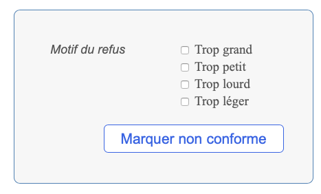

# ATELIER ICARE<br>Manuel développeur

## Introduction

Il s’agit ici de la version produite en 2020 de l’Atelier Icare. Elle vise à simplifier le code au maximum.

<a name="principes"></a>

## Principes fondateurs

* Tout ce qui est après le `/` du domaine et avant le `?` du query-string est appelé `route`. La route brute s’obtient par `Route.current.route`. On l’obtient grâce à `route.to_s` (qui retourne par exemple `bureau/home`. La seule modification faite est de transformer une chaine vide en `home`.
* Quand une route est définie (par exemple `section/page`) la première chose que fait le programme de construction de la page est de voir si le dossier `./_lib/_pages_/section/page` existe. Si c’est le cas, on le charge entièrement, c’est-à-dire le ruby, le css et le javascript. C’est donc dans `_lib/_pages_/` principalement qu’on va trouver la définition des pages et c’est vraiment dans ce dossier qu’il faut s’arranger pour tout mettre.
* Si un module ruby de la page ci-dessus définit la méthode `HTML#exec`, cette méthode est appelée avant la fabrication de la page. Cela permet par exemple de traiter les formulaires.
* Les pages ci-dessus surclassent les méthodes générale `HTML#build_header` etc. et en tout premier lieu la méthode générale **`HTML#build_body`** qui construit le corps de la page.
* Dès qu’un dossier contient des fichiers `.css` ou `.js`, ils sont automatiquement chargés par la méthode générale `require_module`. « Chargés » signifie que leur balise est insérée dans la page.
* Charger vraiment le minimum de code pour toute section. Donc utilisation intensive de la méthode `require_module` qui va charger à la volée des modules depuis le dossier `./_lib/modules/`.

---

## Synopsis du fonctionnement général

### Synopsis très général

```
index.rb
    App.run
        ~ Quelques initialisations
        html.build_page        # construction de la page suivant la route
        html.out                    # sortie et envoi du code à l'utilisateur
        ~ Quelques finitions
```

### Construction de la page (`HTML#build_page`)

```
HTML#build_page
    Chargement de la route. (`Page::load`)
        Par exemple 'ma/route' va charger le dossier
        ./_lib/_pages_/ma/route/ qui contient certainement un fichier
        `html.rb` définissant :
            HTML#exec                    Méthode qui sera appelée tout de suite après le
                                                chargement de la page.
            HTML#build_body        qui sera appelée ensuite pour construire
                                                le @body
            HTML#titre                qui sera appelée plus tard aussi pour obtenir le
                                                titre de la page (+ TITLE)
        De la même manière, tous les fichiers `.js` et `.css` des dossiers
        des routes sont automatiquement chargés.
        Voir aussi la particularité des dossiers `xrequired` ci-dessous.
    Construction des différents éléments de la page
        HTML#titre et HTML#raw_titre sont appelés pour définir les titres
        de la page (titre dans la page et balise TITLE).
    Assemblage final du code de la page
```

---

## Les quatre dossiers principaux

Les trois dossiers où il faut chercher les choses sont :

### _lib/\_pages\_/

C’est là où sont définies toutes les routes. Si on appelle l’url `bureau/home`, c’est le dossier `./lib/_pages_/bureau/home/` qu’on chargera et qui contiendra tous les éléments (HTML, CSS et Javascript) propres à cette route.

### _lib/required/

Contient tous les codes chargés chaque fois.

Définit notamment les grandes classes que sont `User` (pour gérer l’utilisateur) ou `HTML` pour la construction de la page à afficher.

Définit aussi toutes les extensions de classe.

Les éléments notables de ce dossier :

* **`constants/`**. Dossier qui définit les constantes générales, String, Path, etc.
* **`Tag.rb`** qui permet de construire facilement toutes les balises (tags) HTML.

### \_lib/\_watchers_processus\_/

Contient la définition de tous les watchers, tous les processus de watcher.

Noter que ce n’est pas dans ce dossier que se trouve la définition des classes `Watcher` et `Watchers` dans dans le dossier des modules.

### \_lib/modules/

Contient tous les modules propres qui permettent la gestion ponctuelle d'éléments. Ces modules sont pensés pour ne pas avoir à tout charger chaque fois. Par exemple, on ne charge le module `absmodules` — qui permet de travailler avec les modules d'apprentissage absolus — que lorsqu'on en a besoin, pour le bureau de travail de l'icarien par exemple.

> Note : on charge n'importe quel dossier de ce dossier grâce à la méthode pratique `require_module(<nom du dossier>)`.

---

## Débuggage

### Le Traceur

Le traceur permet de suivre en direct ce qui se passe sur le site dans les grandes lignes (connexion, redirection, erreurs, etc.).

#### Placement d'un traceur

On place un traceur dans le code à l'aide de :

```ruby
trace(id: '<identifiant>', message:'<message>', data: {données})
```

On peut aussi utiliser le traceur en mode « sniff », à n’importe quel endroit du programme, en envoyant simplement un string comme argument :

```ruby
trace("Mon message à renifler")
```

> Ces messages portent l’identifiant `SNIFF`

#### Lancement du suivi du traceur

On lance le traceur à l’aide de :

```bash
> icare trace[ options]
```

Options :

```
-e/--error_only            Pour n'afficher que les erreurs programme
-o/--online                    Tracer le site online
```

---

## Création d’une nouvelle route/page

Commencer par lire les [principes fondateurs](#principes) du nouveau site.

Le plus simple est d’utiliser la ligne de commande :

```bash
> icare create route
```

> Note : la suite est assistée.

Pour voir **comment écrire la page** (son texte, son contenu), rejoindre la section [Construction des pages](#constructionpages).

<a name="dossierroute"></a>

Grâce à l’assistant en ligne de commande `> icare create route`, on va pouvoir créer le dossier de la nouvelle route dans `./_lib/_pages_/`. Par exemple, si la route est `user/pourvoir`,  on doit créer le dossier `./_lib/_pages_/user/pourvoir/`. Ce dossier sera  appelé **dossier de la route** dans la suite.

**Attention** : une route ne doit pas être créée dans une autre, puisque tout le dossier d’une route est entièrement chargé, ruby, css, javascript quand elle est appelée (donc le dossier de l’autre route à l’intérieur serait lui aussi chargé…).

Créer dans ce *dossier de la route*  un fichier `html.rb` (ou autre nom, peu importe) qui contienne :

```ruby
class HTML

  def titre
    "Le titre de la page"
  end

  def exec
    ... code à exécuter avant la construction de la page ...
  end

  # Construction du body (section#content)
  def build_body
      # Mettre ici le code de construction du body de la page
    @body = <<-HTML
            ... body de la page ...
        HTML
    end
end
```

Ajouter dans ce dossier les `.css` et les `.js` qui lui sont nécessaires et qui lui sont propres.

Ajouter les vues `ERB` ou `Markdown` qui peuvent servir à construire l’intégralité du body ou une partie seulement. Cf. [Utilisation des vues ERB](#useerbviews).

### Méthode `exec` à appeler

Comme on peut le voir ci-dessus, la méthode `html#exec` permet d’exécuter un code avant de construire la page. C’est ici, par exemple, qu’on vérifie les valeurs d’identification et qu’on authentifie — ou non — l’utilisateur, etc.

```ruby
class HTML
  def exec
    ... code à exécuter avant la fabrication de la page ...
  end
end
```

### Les dossiers `xrequired`

Le chargement des routes respecte le [principe des xrequired][].

---

<a name="principes"></a>

## Principes

<a name="principexrequired"></a>

### Principe des xrequired

Le « principe des xrequired » signifie que lorsqu’on charge un dossier (à l’aide de la méthode `require_module` ou `Page.load`), tous les dossiers `xrequired` se trouvant sur la hiérarchie sont automatiquement chargés. Cela permet d’hériter de méthodes supérieures. Pour les [watchers](#leswatchers), cela permet d’hériter des méthodes utiles lorsqu’un watcher est actionné.

Par exemple, si la route à atteindre est `admin/icariens/outils`, cela fait appel à un dossier se trouvant dans :

```
LIB/_pages_/admin/icariens/outils/
```

> Pour la suite, le dossier `lib` étant amené à changer de nom, j’utiliserai `LIB` pour le désigner.

En appelant cette route, l’application cherche donc à charger les dossiers suivants :

```
LIB/_pages_/admin/icariens/outils/xrequired
LIB/_pages_/admin/icariens/xrequired
LIB/_pages_/admin/xrequired
```

Cela, on le comprend, permet donc de partager des méthodes et des modules dans un même lieu.

> Note : pour les routes, c’est le module [`./_lib/_classes/page.rb` ](/Users/philippeperret/Sites/AlwaysData/Icare_2020/_lib/required/_classes/page.rb) qui s’en charge avec la méthode `load_xrequired`. Pour les modules, c’est la méthode `load_xrequired_on_hierarchy` du module [./_lib/required/__first/require_methods.rb](/Users/philippeperret/Sites/AlwaysData/Icare_2020/_lib/required/__first/require_methods.rb).

<a name="mode_ajax"></a>

### Mode Ajax

Dans cette version, on utilise au minimum le mode Ajax pour la partie publique du site. En revanche, il est utilisé intensivement pour la partie d'administration du site.

> Cf. tout ce qui concerne la [partie Javascript du site](#javascript).

---

## Paramètres URL

#### Obtenir la valeur d’un paramètre

Pour obtenir un paramètre passé par l'URL, on utilise la méthode :

```ruby
param(:<key>)                            param(:op)
# => valeur de :<key>            # => retourne la valeur de &op=...
```

> Note : on peut utiliser indifféremment un String ou un Symbol comme clé, mais elle sera toujours transformée en `Symbol` dans les paramètres.

#### (Re)définir la valeur d'un paramètre

On peut définir ou redéfinir ce paramètre à la volée en cours de programme, à l’aide d’un second argument :

```ruby
param(:<key>, <new value>)                                param(:op, "nouvelle-operation")
# Met la valeur de :<key> à <new value>        # Met :op à "nouvelle-operation"

# Si la clé est inexistante, cela la crée, ce qui permet de passer des valeurs à
# travers tout le programme.
```

> Noter que ce changement est « définitif ». La valeur initiale sera supprimée. Mais on peut définir un nouveau paramètres en prenant garde des collisions de nom :
> 
> ```ruby
> param(:old_op, param(:op))
> param(:op, "nouvelle opération")
> ```

---

## Requérir des modules à la volée

Requérir des modules à la volée permet de ne charger que le code nécessaire à une section. C’est un principe fondateur du nouvel atelier.

On les charge à l’aide des méthodes :

```ruby
require_module('nom-module')

require_modules(['module1', 'module2', ..., 'moduleN'])
```

Requérir un module signifie :

* requérir tous ses fichiers ruby (`.rb`), dans son dossier ou ses sous-dossiers,
* charger les feuilles de styles (`.css`) de son dossier et ses sous-dossiers,
* charger les javascripts (`.js`) de son dossier et tous ses sous-dossiers,
* requérir tous les éléments des dossiers `xrequired` de ses ascendants selon le [principe des xrequired][].

> Pour requérir un module javascript (ses fichiers js et css), cf. [Requérir un module javascript](#require_js_module).

Ces modules doivent se trouver dans le dossier :

```bash
LIB/modules/
```

## Charger un fichier au même niveau (chemin absolu à partir d'un chemin relatif)

Si on veut charger un fichier se trouvant au même niveau que le module appelant, on peut utiliser la méthode `full_path`.

Soit deux fichiers dans le même dossier :

```bash
dossier/fichier.rb
        fichier.yaml
```

On  peut charger le fichier `yaml` dans le module ruby à l'aide de :

```ruby
data = YAML.load_file(full_path('fichier.yaml'))
```

---

## Redirection

Pour rediriger le visiteur vers une page particulière, on peut utiliser la méthode :

```ruby
redirect_to('<route>')
```

---

## Les icariens

Les icariens et les icariennes sont des `User`s.

Le visiteur courant est toujours accessible dans le programme par `user`.

> Note : il ne faut donc jamais utiliser ce nom comme variable. Préférer `_user` ou même `icarien`. Dans beaucoup de cas, `owner` est la meilleure solution, en sachant que c’est un mot réservé pour beaucoup de classes.

Un visiteur non identifié répond positivement à **`user.guest?`**.

### Options des icariens

Les options des icariens (propriété `:options`) permet de les caractériser dans les moindres détails.

En général, pour récupérer des icariens :

* on s'assure que le bit 0 soit à 0, sinon c'est un administrateur,
* on s’assure que ce ne soit pas le visiteur #9 (qui est John Doe),
* on s'assure que le bit 3 (4e) soit à 0 (sinon, à 1, c'est un icarien détruit),
* on regarde dans le bit 16 (17e) le statut de l'icarien (actif, inactif, etc.),
* on regarde dans le bit 24 (25e) s'il est "réel" (s'il a déjà payé).

| Bit (0-start) | Description                                                                                                                                                                                                                                                                                                              |
| ------------- | ------------------------------------------------------------------------------------------------------------------------------------------------------------------------------------------------------------------------------------------------------------------------------------------------------------------------ |
| 0             | > 0 => administrateur du site.  <br />> 1 => super administrateur (moi)                                                                                                                                                                                                                                                  |
| 1             | Bit de grade                                                                                                                                                                                                                                                                                                             |
| 2             | 1: le mail a été confirmé                                                                                                                                                                                                                                                                                                |
| 3             | **Bit de destruction**<br />1 si l’icarien a été détruit. Note : toutes ses « productions » sur le site devient anonymes (`user_id` = 9).                                                                                                                                                                                |
| 4             | **Bit de fréquence de mail**<br />0: quotidien, 1:hebdomadaire, 9: aucun mail                                                                                                                                                                                                                                            |
| 5             | **Bit de concours**<br />0: le bit n’a pas été défini, 1: l’user fait le concours, 2: l’user ne fait pas le concours<br />Noter le fonctionnement particulier de ce bit, qui contient une valeur 0 quand il n’est pas défini, permettant ici à la méthode `concurrent?` de le définir, pour accélérer les vérifications. |
| 6             |                                                                                                                                                                                                                                                                                                                          |
| 7             |                                                                                                                                                                                                                                                                                                                          |
| 8             |                                                                                                                                                                                                                                                                                                                          |
| 9             |                                                                                                                                                                                                                                                                                                                          |
| 10            |                                                                                                                                                                                                                                                                                                                          |
| 11            |                                                                                                                                                                                                                                                                                                                          |
| 12            |                                                                                                                                                                                                                                                                                                                          |
| 13            |                                                                                                                                                                                                                                                                                                                          |
| 14            |                                                                                                                                                                                                                                                                                                                          |
| 15            |                                                                                                                                                                                                                                                                                                                          |
| 16            | **Bit de statut** (ou d’activité)<br /><br />0 : non défini, <br />1: invité (visiteur non identifié), <br />2 : actif, <br />3 : candidat, <br />4 : inactif (ancien)<br />5 : détruit<br />6 : reçu<br />8: en pause                                                                                                   |
| 17            | **Bit de non contact par mail**<br />OBSOLÈTE. Cf. 26, 27 et 28                                                                                                                                                                                                                                                          |
| 18            | **Bit de redirection**<br />Détermine la section à rejoindre après l’identification. Cf. TODO                                                                                                                                                                                                                            |
| 19            | **Bit de contact**<br />OBSOLÈTE. CF. bit 26                                                                                                                                                                                                                                                                             |
| 20            | **Bit d'entête**<br />1: l’entête du site doit être cachée (inusité dans la version actuelle)                                                                                                                                                                                                                            |
| 21            | **Bit d’historique partagé**<br />0: avec personne, 1: avec les icariens,  8: avec le monde (1 par défaut)                                                                                                                                                                                                               |
| 22            | **Bit de notification de message**<br />Si 1, l’icarien est averti par mail lorsque quelqu’un lui laisse un message sur son frigo.                                                                                                                                                                                       |
| 23            | **Bit de contact avec le monde**<br />OBSOLÈTE. Cf. bit 28                                                                                                                                                                                                                                                               |
| 24            | **Bit de « réalité »**. Il est à 1 si c’est un « vrai » icarien, c’est-à-dire si c’est un icarien qui a déjà effectué un paiement.                                                                                                                                                                                       |
| 25            |                                                                                                                                                                                                                                                                                                                          |
| 26            | **Bit de contact avec l'administration**<br />0: aucun, 1:mail, 2:frigo   (ce sont des bits qui s’ajoutent donc 1\|2 pour mail et frigo)<br />> Note : Ancien bit 19                                                                                                                                                     |
| 27            | **Bit de contact avec les autres icariens**<br />0: aucun, 1:mail, 2:frigo   (ce sont des bits qui s’ajoutent donc 1\|2 pour mail et frigo)                                                                                                                                                                              |
| 28            | **Bit de contact avec le reste du monde**<br />0: aucun, 1:mail, 2:frigo   (ce sont des bits qui s’ajoutent donc 1\|2 pour mail et frigo)<br />Note : ancien bit 23                                                                                                                                                      |
| 29            |                                                                                                                                                                                                                                                                                                                          |
| 30            |                                                                                                                                                                                                                                                                                                                          |
| 31            |                                                                                                                                                                                                                                                                                                                          |

#### Redirection après login de l'icarien

Note : c’est le bit 18 des options ci-dessus.

| Valeur | Redirection                                                     |
| ------ | --------------------------------------------------------------- |
| 0      | Vers le bureau de travail (table de bord pour l'administrateur) |
| 1      | Accueil du site (vraiment la toute première page)               |
| 2      | Page de profil de l'icarien                                     |
| 3      | Dernière page consultée                                         |
| 4      | Section des notifications du bureau                             |
| 5      | Section du travail en cours                                     |
|        |                                                                 |
| 7      | Tableau de bord pour l’administrateur seulement                 |
| 8      | Console d'administration                                        |
| 9      | Panneau des notifications                                       |

### Envoi d'un mail à un icarien

```ruby
<user>.send_mail(subject:"Le sujet", message:"<p>le message HTML</p>")
```

---

## Modules et étapes de l'icarien

### Modules de travail

Le module courant de l'icarien est défini dans sa propriété `icmodule_id`.

#### Options du module de travail

Les options du module de travail est un string de 16 bits (`options`). Pour le moment, ces options ne servent à rien.

### Étapes de travail

#### Statut de l'étape

C’est la propriété `:status` qui définit l’état de l’étape de travail. La propriété porte le même nom.

Les valeurs sont les suivantes :

| Bit | Statut                                                                                                                                                        |
| --- | ------------------------------------------------------------------------------------------------------------------------------------------------------------- |
| 0   | Non utilisé, ne devrait pas arriver                                                                                                                           |
| 1   | L’étape est en cours, l’icarien travaille dessus. <br />Watcher de wtype `send_work`.                                                                         |
| 2   | L’icarien a transmis ses documents mais ils n’ont pas encore été downloadés par Phil.<br />Watcher de wtype `download_work`.                                  |
| 3   | Phil a downloadé les documents de travail de l’icarien.<br />Watcher de wtype `send_comments`.                                                                |
| 4   | Phil a transmis les commentaires, mais l’icarien ne les a pas encore downloadés.<br />Watcher de wtype `download_comments`                                    |
| 5   | L’icarien a downloadé ses commentaires.<br />Watcher qui permet à Phil de déposer les documents sur le Quai des docs (wtype `depot_qdd`).                     |
| 6   | Phil a déposé les documents de l’étape sur le Quai des docs.<br />Watcher qui permet à l’icarien de définir le partage de ses documents `qdd-define-sharing`. |
| 7   | L’icarien a défini le partage de chacun de ses documents.                                                                                                     |
| 8   | Fin de cycle de l'étape                                                                                                                                       |

#### Édition d'une étape de travail de module d'apprentissage

* Rejoindre la **section « Modules » de l'administration** (depuis le bureau/tableau de bord),
* choisir le module d'apprentissage de la nouvelle étape,
* cliquer sur le titre de l'étape à modifier,
* cliquer sur le bouton "Éditer" de l'étape (en tenant le bouche ⌘ appuyée si on veut l'éditer dans une nouvelle fenêtre),
* remplir le formulaire et le soumettre.

#### Création d'une nouvelle étape de travail

* Rejoindre la **section « Modules » de l'administration** (depuis le bureau/tableau de bord),
* choisir le module d'apprentissage de la nouvelle étape,
* bien repérer le nouveau numéro à créer,
* cliquer sur le bouton "Nouvelle étape",
* remplir le formulaire et le soumettre.

#### Helpers pour les étapes de travail

Avant tout, précisons que les étapes se définissent dans la **section « Modules » de l'administration**. Il suffit de choisir un module, d'afficher l'étape voulue et de cliquer sur le bouton “Éditer” pour éditer l'étape en question.

##### Méthodes d'helper

Toutes les méthodes du module [./_lib/required/__first/helpers/string_helpers_module.rb](/Users/philippeperret/Sites/AlwaysData/Icare_2020/_lib/required/__first/helpers/string_helpers_module.rb) sont accessible depuis les travaux et les méthodes des étapes.

> Rappel : cela tient simplement au fait que toute classe qui hérite de `ContainerClass` hérite aussi de ces méthodes.

##### Section document

Une “section document” dans le travail d'une étape de travail permet d'illustrer ce travail par un exemple de document ou un modèle. On définit cet exemple ainsi :

```markdown
<!document>

... ici le document ...

<!/document>
```

À l'intérieur de ce document, les titres commencent à un seul dièse :

```markdown
<!document>

# Un grand titre de page

## Titre dans le document

[Contenu]

## Autre titre du document

[Contenu]

<!/document>
```

### Travaux types

On peut insérer les travaux-types dans une étape de travail grâce à :

```
#{travail_type('<rub>','<name>')}  <%= travail_type('<rub>','<name>') %>
```

> Noter que maintenant il est impératif de mettre les parenthèss dans les deux formats.

### Documents icariens (`icdocuments`)

Le travail au sein de l'atelier se fait sur la base de documents qui sont envoyés par l'icarien et commentés par Phil.

#### Options des documents

Les options de l'icdocument tiennent sur un mot de 16 bits qui peuvent prendre une valeur entre 0 et 9. Les 8 premiers bits concernent le document original (non commenté) les 8 bits suivant concernant le document commenté.

| Bit  | Description de la valeur du bit                                                        |
| ---- | -------------------------------------------------------------------------------------- |
| 0    | 1 => Le document original existe                                                       |
| 1    | **Partage de l'original**<br/>0: partage non défini, 1: partagé, 2: non partagé        |
| 2    | 1 => le document a été téléchargé par l'administrateur                                 |
| 3    | 1 => le document original a été déposé sur le Quai des docs                            |
| 4    | 1 => le partage du document a été défini                                               |
| 5    | 1=> le document original a achevé son cycle complet                                    |
| 8    | 1=> Le document commentaires existe                                                    |
| 9    | **Partage du document commenté**<br/>0: partage non défini, 1: partagé, 2: non partagé |
| 10   | 1=> le document commenté a été téléchargé par l'auteur                                 |
| 11   | 1=> le document commentaire a été déposé sur le Quai des docs                          |
| 12   | 1=> le partage du document commentaires a été défini                                   |
| 13   | 1=> le document commentaire a achevé son cycle complet                                 |
| ---- | ------------------------------------------------------------                           |

---

## Base de données

Les requêtes sont toutes exécutées soit sur la base `icare` ou sur la base `icare_test` (en mode de test et sandbox).

### Exécution d’une requête quelconque (`db_exec`)

La méthode la plus « simple » d’utilisation est la méthode `db_exec` qui exécute la requête qui lui est fournie en premier argument :

```ruby
db_exec("SELECT * FROM icdocuments FROM user_id = 12 LIMIT 12 ORDER BY original_name")
# => retourne la liste de toutes les données des documents de l'user #12, dans une
#    limite de 12 documents, en les classant par le nom original.
```

### Nombre d’éléments d’une table (`db_count`)

La méthode `db_count` retourne le nombre d’élément d’un table, en respectant ou non un filtre :

```ruby
db_count("<table>"[, {filtre}])
# Retourne le nombre d'éléments de <table> qui respectent le filtre {filtre}
```

> Le `filtre` peut-être un string qui correspond à la clause WHERE (sans « where »).

### Création simplifiée d’une nouvelle donnée (`db_compose_insert`)

La méthode `db_compose_insert` permet de composer facilement une nouvelle données à créer.

La commande :

```ruby
db_compose_insert('table', {<data>})
```

… va produire la même chose que :

```ruby
valeurs.merge!(updated_at: Time.now.to_i.to_s, created_at:Time.now.to_i.to_s)
valeurs = data.values
columns = data.keys.join(VG)
interro = Array.new(valeurs.count,'?').join(VG)
request = "INSERT INTO #{table} (#{columns}) VALUES (#{interro})"
db_exec(request, valeurs)
```

### Actualisation simplifiée d’une donnée (`db_compose_update`)

La méthode `db_compose_update` permet de composer facilement une donnée à actualiser.

La commande :

```ruby
db_compose_update('<table>', <id>, <data>)
```

… va produire la même chose que :

```ruby
data.merge!(updated_at: Time.now.to_i.to_s)
valeurs = data.values << id
columns = data.keys.collect{|c|"c = ?"}.join(VG)
request = "INSERT <table> SET #{columns} WHERE id = ?"
db_exec(request, valeurs)
```

---

## Messagerie

Pour les messages, on peut utiliser les méthodes suivantes :

### `message("...")` ou `notice("...")`

Pour un message d’information.

### `erreur("...")`

Pour un message d’erreur.

### `log("... »)`, `log(<error>)`, `log({hash})`

Pour un message dans le journal de suivi. Comme le titre l’indique, on peut envoyer indifféremment un string, une erreur ou une table.

### Constantes de messages

On peut trouver dans le fichier `./_lib/required/__first/constants/errors.rb` des constantes de messages d’erreur qui peuvent être appelés par `ERRORS[:<key>]`. On peut trouver de la même manière des messages notice par `MESSAGES[:<key>]`.

Certains messages peuvent même comporter des variables qu’on modifie par :

```ruby
erreur( ERRORS[:message_variable] % {var:'première', var2:'deuxième'})

# ou

erreur( ERRORS[:message_vars] % ['première', 'deuxième'])

# Avec :

ERRORS = {
  ...
  message_variable: "Mon %{var} et %{var2}.",
  message_vars: "Mon %s et %s."
 }
```

### Envoi des erreurs à l'administration

Pour pouvoir signaler (par mail) des erreurs à l'administration, on utilise la méthode :

```ruby
send_error("<message d'erreur>"[, {<data>}])
# => Produit un mail qui m'est envoyé
```

---

## Envoi de mail

Pour l'envoi des mails, on utilise maintenant au maximum la class `MailSender` qui présente deux avantages et non des moindres :

* elle permet de faire des mailings, en deux temps, avec confirmation de l'envoi après avoir vérifié le mail au masculin et au féminin, ainsi que la liste des destinataires,
* elle permet de définir le sujet du mail DANS le mail (fichier erb) ce qui n'était pas le cas avant.

Pour pouvoir fonctionner, `MailSender.send` a donc besoin de trois données seulement :

* le destinataire (et/ou l'expéditeur) (`:to` ou `:from`),
* le chemin d'accès au fichier `ERB` (`:file` ou `:path`),
* l'objet bindé (`:bind`).

Par exemple :

```ruby
require_module('mail')
MailSender.send(to:user.mail, file:"mon/fichier/mail", bind: user)
```

> On peut ajouter `no_citation:true` pour ne pas écrire de citation dans le mail.

### Envoi de mailing

Pour envoyer un mailing, on utilise la méthode `MailSender#send_mailing` avec les paramètres :

```ruby
require_module('mail')
MailSender.send_mail({to: [destinataires], file: "path/to/mail", bind:bindee}, {options})
```

où `options` est une table optionnelle pouvant contenir :

```
:noop            Si TRUE, on se contente de simuler l'envoi
```

### Ancienne méthode (éviter de l'utiliser)

Pour envoyer un mail à un destinataire quelconque, on utilise la méthode générique :

```ruby
Mail.send(to: "<email>", subject: "<sujet>", message: "<message>")
```

> Note : par défaut, le `:to` (destinataire) et le `:from` (expéditeur) sont mis à l'adresse du site. Donc quand on veut m'envoyer un message, il suffit de ne pas mettre de `:to`.

---

<a name="constructionpages"></a>

## Construction des pages, helpers

> Note : on peut créer les dossiers et fichier des nouvelles routes de façon assistée grâce
> 
> ```bash
> > icare create route
> ```

### Format des fichiers des pages

Construire une page consiste à définir la variable `html#body` (`@body`) qui va être insérée dans la page, aisni que le titre.

Une page peut être au format `ERB` ou au format `Markdown` (étendu). Les deux formats permettent l'utilisation des variables :

* `<%= variable|méthode %>` pour le format `ERB`,
* `#{variable|méthode}` pour le format `Markdown`.

Si un code compliqué (if, etc.) doit être utilisé dans le format `Markdown`, il doit impérativement être mis sur une seule ligne. Sinon, privilégier le format `ERB`.

Noter qu’on peut se servir des méthodes pour mettre en forme. Par exemple, dans un fichier Markdown, on peut utiliser la méthode d'helper générale `par` pour centrer un paragraphe :

```markdown
#{par("Ceci est un paragraphe centré", :center)}

<!-- version DIV -->

#{div("Ceci est un div centré", :center)}
```

### Traitement en fonction du format

On peut traiter un code indifféremment en ERB ou en MARKDOWN grâce à la méthode :

```ruby
deserb_or_markdown("<code erb ou markdown>"[, objet_a_binder])
```

> Noter que le code est "safé" dans la méthode, donc il est inutile de forcer son encodage avant.

### Traitement spécial / Mises en forme spéciales

La méthode [`String#special_formating`](/Users/philippeperret/Sites/AlwaysData/Icare_2020/_lib/required/__first/extensions/String_special_formating.rb) permet d’exécuter les dernières mises en forme sur les textes propres à l’atelier Icare.

Cette méthode est appliquée à la fin des méthodes `deserb`, `kramdown` et `deserb_or_kramdown`. Pour ne pas l’appliquer — c’est nécessaire parfois, lorsqu’on doit éditer du code, par exemple, comme les étapes de modules —, il faut mettre dans le troisième argument — les options — la propriété `formate: false` :

```ruby
str = deserb_or_kramdown('# Mon code', <binder>, {formate: false})
# => produit un code sans formatage spécial.
```

#### Mises en forme spéciales

Les mises en forme traitées, principalement utilisées dans les pages d’étape, sont :

Toutes ces mises en forme commencent par `<!`. Si elles encadrent du texte, elles terminent par `<!/` avec la même suite. Par exemple `<!div.mondivspécial>` et `<!/div.mondivspécial>`.

**Illustration de document**

```
<!div.document>
...
... une illustration de document
... traitée comme du code markdown
... le premier niveau de titre commence à #
...
<!/div.document>
```

### Titre de la page

Le titre de la page est défini par la méthode `HTML#titre`.

Quand le titre doit être « détaché » du bandeau de log et du contenu de la page — comme cela arrive avec le hall of fame par exemple, on peut utiliser la constante `DIV_AIR` pour ajouter de l’air.

Par exemple :

```ruby
class HTML
  def titre
    @titre ||= "#{DIV_AIR}Mon beau titre#{DIV_AIR}".freeze
  end
  ...
end #/HTML
```

### Liens outils utiles en regard du titre

On peut ajouter des liens utiles en regard du titre de la page (à droite) à l'aide de la méthode `userfull_links` qui doit retourner une liste des boutons (`a`, `button`, `form`) à ajouter :

```ruby
class HTML
    ...
    def usefull_links
        [
            Tag.lien(route: "ma/route", text:"le titre"),
            Tag.lien(route: 'autre/route', text:'autre texte')
            ...
        ]
    end
end #/HTML
```

### Liens principaux

On peut utiliser la classe `MainLink` pour récupérer (ou définir) des liens généraux, récurrents, qui sont utilisés souvent.

Ces liens sont définis dans le fichier [constants/MainLink.rb](/Users/philippeperret/Sites/AlwaysData/Icare_2020/_lib/required/__first/constants/MainLink.rb), dans la constante `MainLink::DATA_KEY`.

Pour obtenir un lien simple, c'est-à-dire avec le titre par défaut en minuscule et pas de picto (faux émoji), on utilise simplement la méthode `simple` :

```ruby
MainLink[:contact].simple
# => Produit le lien vers le formulaire de contact
```

Si on remplace la méthode `simple` par la méthode `with` on peut définir beaucoup de choses :

> Tous les exemples ci-dessous sont cumulables.

```ruby
MainLink[:contact].with(text: 'nouveau texte du lien')
# Pour changer le titre visible du lien

MainLink[:contact].with(picto: true)
# Pour ajouter le picto devant le titre

MainLink[:contact].with(titleize: true)
# Pour mettre une capitale au titre du lien ('contact' -> 'Contact')

MainLink[:contact].with(pastille: 'la pastille')
# Cas d'utilisation unique, pour remplace '%{non_vus}' par le
# texte fourni
```

> Pour la gestion des faux Émojis, cf. [faux émojis](#faux-emojis)

### Les images

Les images doivent toutes être au format JPEG 2000 (qui permet la transparence comme les PNG). Elles doivent comporter plusieurs tailles pour permettre au browser de choisir la meilleure taille.

Balise à utiliser : 

```html
.jp2 <size>w"
```

Voir le dossier `_dev_/scripts/Image/` qui contient des scripts et de l'aide pour les images (en attendant de les basculer en CLI).

### Méthodes d'helpers générales

Le module `LIB/required/__start/helpers/string_helpers_module.rb` qui définit le module `StringHelpersMethods` permet d'ajouter les méthodes d'helpers générales à toutes les classes qui en ont besoin.

**Une classe héritant de `ContainerClass` hérite aussi de ces méthodes**. Il n’y a donc rien à faire.

cf. le [module des strings helpers](/Users/philippeperret/Sites/AlwaysData/Icare_2020/_lib/required/__first/helpers/string_helpers_module.rb).

Pour pouvoir utiliser/avoir accès à ces méthodes n’importe où, on utilise :

```ruby
    StringHelper#<methode>

    # Par exemple :

    StringHelper.politique_confidentialite
```

Extraits de méthodes :

```
mot(mot_id, le_mot)            Produit un lien vers un mot du scénodico
page(page_id, titre)        Produit un lien vers une page de la collection narration
```

### Méthodes de formatage pratiques

On trouve dans le module [\_lib/required/\_\_first/extensions/Formate\_helpers.rb](/Users/philippeperret/Sites/AlwaysData/Icare_2020/_lib/required/__first/extensions/Formate_helpers.rb) des méthodes pratiques comme la méthode `formate_date(...)` qui permet d'obtenir facilement une date humaine du moment présent (sans argument) ou d'un temps/date donné en argument.

```ruby
formate_date()
# => Retourne le temps courant comme : "19 juin 2020"

formate_date(time)
# => Retourne le temps +time+ comme : "17 juillet 2020"

formate_date(time, {mois: :court})
# => "17 juil 2020"

formate_date(time, {duree: true})
# => "17 juillet 2020 (dans 29 jours)"

formate_date(nil, {hour: true}) # ou time:true
# => "19 juin 2020 10:37"
```

### Caractères spéciaux

#### Tiret de liste (« –␣ »)

Pour obtenir un tiret de liste qui laisse vraiment le même espace entre le tiret et le texte malgré la justification, on utiliser `#{TIRET}Le texte`.

```
#{TIRET}C'est le premier item de liste.

#{TIRET}C'est le deuxième item de liste. Ils devraient tous être
plus long pour voir comment est réparti l'espace.

#{TIRET}Un troisième item de liste.
```

<a name="faux-emojis"></a>

### Faux Émojis

Les émojis étant affreux sur PC windows 10 (et autres), on ne peut pas utiliser les émojis normalement. On utilise à la place des images qui se trouvent dans le dossier `img/Emojis`.

Pour utiliser un émoji, on utilise la classe `Emoji` :

```ruby
emoji = Emoji.get('dossier/nom-fichier')

emoji.texte
# Produit la version textuelle (en taille) de l'émoji
```

Les tailles suivantes existent :

```
tiny                    # Très petit
mini
small
texte                    # Pour les utiliser dans le texte
regular                # Par exemple dans les div.goto
page_title        # spécialement pour les pages de titre
large
big
```

#### Fabrication des faux émojis

Les images des faux émojis sont des fichiers `PNG` de 480px sur 480px.

On peut les fabriquer facilement avec le fichier [./\_dev\_/Emoji/show.html](/Users/philippeperret/Sites/AlwaysData/Icare_2020/_dev_/Emoji/show.html) qui explique en détail toute la procédure (il suffit au départ de placer l'émoji dans ce fichier show.html et de l'ouvrir dans Safari par exemple.

### Contenu de la page

Le plus simple est d’écrire le contenu, le texte, dans le fichier `body.erb` ou `body.md` qui peut se trouver à la racine du dossier, et sera  appelé par :

```ruby
# Format ERB
class HTML
    ...
    def body
        @body = deserb('body', <owner>)
    end
    ...
end #/HTML
```

```ruby
# Format Markdown
class HTML
    ...
    def body
        @body = kramdown('body', <owner>)
    end
    ...
end #/HTML
```

De nombreux helpers aident ensuite à rédiger les pages avec plus de facilités.

On peut citer notamment ces méthodes et classes indispensables.

* La classe **Tag** qui permet de produire toutes les balises nécessaires (cf. ci-dessous).
* La méthode générique **Tag.lien(…)** qui permet de produire facilement un lien.
* La méthode **Tag.aide(id)** qui permet de générer un lien vers un fichier d’aide (voir [Aide](#laide).
* La méthode **Tag.info_bulle(...)** qui permet de mettre une info-bulle sur un mot.
* La méthode **formate_date(time)** qui permet de mettre en forme une date.

### `Tag`, builder de balises

La classe `Tag`, définies dans [helpers/Tags.rb](/Users/philippeperret/Sites/AlwaysData/Icare_2020/_lib/required/__first/helpers/Tag.rb), permet de créer très facilement des balises à l’aide de la méthode :

```ruby
Tag.<type balise>({<params>})
```

Par exemple :

```ruby
lien = Tag.div(class:"ma-class", text:"Le contenu du div")
```

Voir dans le fichier ci-dessus toutes les méthodes utilisables.

Pour les tags propres aux liens, cf. [Les Liens](#liens).

<a name="specsblocks"></a>

### Blocs particuliers

Plusieurs méthodes permettent de produire rapidement du code, lorsqu’il est fréquent. C’est le cas des méthodes suivantes.

> De manière générale, on trouve les méthodes helpers dans le dossier `./lib/required/__first/handies` mais il faut comprendre aussi que des méthodes particulières sont définies dans les modules (par exemple les helpers pour les formulaires, dans le module 'forms').

#### Les div boutons (buttons)

```ruby
<div class="buttons">
</div>
```

Ils sont toujours formatés en respectant les règles suivantes :

* ils ont le fer à droite,
* ils laissent de l’air au-dessus de leur tête,
* traitent tous les liens `<a>` comme des boutons (class `btn`),
* traitent tous les liens `<a class="main">` comme des boutons principaux.

#### Les "divRow"

La méthode d'helper `divRow(...)` permet de construire une rangée avec un élément à gauche — en général le libellé, en premier argument — et un élément à droite — en général la valeur, en deuxième argument. Le troisième argument permet de passer des options qui permettent d'affiner l'affichage.

```ruby
divRow("mon libellé à gauche", "Ma valeur à droite"[, {<options>}])
# => Produit un div.row-flex
```

```ruby
options = {
    libelle_size:        Integer,     # largeur en pixel du libellé
    value_size:            Integer,     # largeur en pixel du span valeur
    class:                    String        # la class CSS à ajouter au div principal
}
```

<a name="blocgoto"></a>

#### Les blocs « GoTo »

```ruby
divGoto("... inner ...", route:'la/route')
```

Pour écrire un lien dans un « bloc » comme ceux qu’on peut trouver sur la page de plan ou sur les accueils de bureau.


Quand il y en a plusieurs et qu’on veut en mettre en exergue, on peut ajouter la classe `exergue` de cette façon :

```html
<div class="goto exergue">
  ... le contenu ...
</div>
```

Avec la méthode divGoto :

```ruby
div = divGoto('<inner>', route: 'vers/endroit', exergue: true)
```

<a name="infosbulles"></a>

#### Les info-bulles

Les « info-bulles » permettent de faire apparaitre du texte d’aide au survol d’un élément, en général un point d’interrogation grisé.

On les obtient à l’aide de :

```ruby
Tag.info_bulle("Le message à faire apparaitre.")
```

| Mouse out                     | Mouse over                     |
| ----------------------------- | ------------------------------ |
|  |  |

On peut également mettre un message bulle sur un texte à l’aide du code suivant :

```erb
C'est du texte avec un mot qui porte <%= Tag.info_bulle("Le message à faire apparaitre en survolant le mot", {text: "une info-bulle"}) %> qui devrait apparaitre au survol de la souris et disparaitre ensuite.
```

Les données peuvent être fournies « à l’envers »  (pour une lecture plus facile) :

```erb
C'est du texte avec un mot qui porte <%= Tag.info_bulle("une info-bulle", {aide: "Le message à faire apparaitre en survolant le mot"}) %> qui devrait apparaitre au survol de la souris et disparaitre ensuite.
```

Ce qui va produire :


#### Les « listes d'état » (StateList)

```ruby
StateList.row("libelle", value[, {options}])
```

Génère une rangée de type « Statelist » comme on peut en trouver sur la page du travail courant pour afficher l’état du module (nom, échéance)


**NOTE** : pour que ces rangées s’affichent correctement, il faut entourer le code généré par un  `div.state-list` (ou un `div.state-list.vert` pour un fond vert comme ci-dessus) :

```erb
<div class="state-list vert">
  <%= StateList.row("Mon libellé", "Ma valeur", {class:'small'})
</div>
```

> Comme on peut le voir ci-dessus, on peut ajouter un troisième argument qui contiendra des options d’affichage, comme ici la classe à appliquer à la rangée.

Pour **différentes largeurs de libellés**, on peut utiliser les classes `medium` (libellé de taille moyenne) et `large` (libellé large).

Si l’on préfère que les libellés soient **alignés à gauche**, on ajoute la classe `left`.

Ainsi, si on veut une liste avec large libellé alignés à gauche, on utilise :

```html
<div class="state-list large left">
  <%= StateList.row("Mon libellé plus large fer à gauche", "une valeur") %>
</div>
```

##### Bouton pour modifier les données de la StateList

Si les données contenues dans la **StateList** sont modifiables, on peut ajouter un bouton (crayon pour le moment) qui permet de se rendre au formulaire de modification :

```erb
<div class="state-list">
    #{StateList.button_modify('<route>'[, {options}])}
  ...
</div>
```

Dans les `{options}`, on peut définir une `:class` supplémentaire ou un `:title` qui apparaitra quand on glisse la souris sur le bouton.

---

<a name="liens"></a>

## Les Liens

Cette partie contient tout ce qui concerne les liens et leur gestion.

### Helper de liens (Tag.link)

La classe `Tag` permet de produire des liens facilement :

```ruby
lien = Tag.link(route:"ma/route", text:"Suivre ma route")
```

On peut ajouter à la table d'arguments :

```text
:class
    La ou les classes CSS du lien. P.e. "btn" pour un bouton

:distant        true/false
        Si TRUE, c'est l'adresse distante complète qui est utilisée.

:full   true/false        
        Pour écrire le lien en entier, par exemple pour un mail. Noter que
        :distant ci-dessus ne fait pas exactement la même chose. Par exemple,
        pour les tests, il faut utiliser :full pour que les liens soient 
        locaux et puissent être testés en local.
```

#### Lien vers le bureau

```ruby
Tag.lien_bureau([titre])
# Note : il vaut mieux ne pas utiliser `[titre]` pour avoir un picto avec "Bureau"
```

### Constantes LIENS fréquents

#### Liens de retour (pour revenir à une partir principale)

```ruby
RETOUR_BUREAU        # Pour retourner au bureau (avec le signe ↩︎ devant)
RETOUR_PROFIL        # Pour retourner au profil (avec le signe ↩︎ devant)
```

On peut aussi obtenir des liens vers des routes connues grâce à la méthode `Tag.route`, en passant en premier argument soit un raccourci de route (par exemple `:aide` pour l’aide) soit une route explicite.

Les raccourcis de route sont définis dans le fichier [./_lib/required/__first/constants/routes.rb](/Users/philippeperret/Sites/AlwaysData/Icare_2020/_lib/required/__first/constants/routes.rb).

On utilise alors :

```ruby
Tag.route(:<route id>[, "titre", {options}])
```

> Dans `options`, on peut par exemple indiquer `full: true` pour créer un URL entière qui pourra être utilisée dans les mails.
> 
> Noter que c’est le cas, de manière générale, avec toutes les méthodes générant des liens, à commencer par `Tag.lien`.

#### Lien « retour » pour titre

Pour définir un lien à ajouter au titre des pages, ressemblant à :

… on utilise la méthode :

```ruby
Tag.retour(:route, :titre)
# Les deux arguments sont obligatoire
```

---

<a name="javascript"></a>

## Javascript

Par défaut, il doit être fait un usage minimal de javascript (c'est un choix, peut-être que la version suivante prendra l'option opposée). Par défaut, jQuery et Ajax, par exemple, ne sont pas chargés.

<a name="require_js_module"></a>

### Requérir un module javascript

Ce qu'on appelle un « molule javascript », c'est un dossier qui contient 

* des fichiers javascript (`.js` ou `.mjs`),
* des fichiers CSS utiles au module pour la mise en forme.

Par nature, ces dossiers se trouvent dans le dossier `./js/modules/`. Voir par exemple le module `./js/modules/flash` qui contient les méthodes et classes utiles pour gérer les messages à l'utilisateur quand on est en [mode ajax](#mode_ajax).

Pour requérir un de ces modules on utilise la méthode `require_module_js` (ou son alias `require_js_module`) :

```ruby
require_module_js('flash')
# ou 
require_js_module('flash')
```

On peut charger plusieurs modules à l'aide de cette méthode (ou `require_modules_js` ou `require_js_modules`) :

```ruby
require_modules_js(['flash', 'autres', 'modules'])
```

Un module peut se trouver dans une autre location (mais c'est vraiment à éviter), on l'appelle alors avec son chemin complet :

```ruby
require_js_module("./path/to/my/folder/module/name")
```

### Charger un module en différé

Quand des feuilles javascript (appelées ici improprement « modules ») sont chargées d’un dossier, elles le sont dans n’importe quel ordre. Pourtant, souvent, par exemple avec les classes abstraites, il est nécessaire de charger d’abord les modules des classes abstraites et ensuite les modules des classes qui en héritent.

Dans ce cas, on peut utiliser l’extension `.defer.js` qui permettra de différer le chargement du module. C’est le module ruby [HTML/css_n_js.rb](/Users/philippeperret/Sites/AlwaysData/Icare_2020/_lib/required/_classes/HTML/css_n_js.rb) qui se charge de ce comportement

---

## Styles particuliers

### Outils discrets

Les outils discrets sont des boutons qui ont une faible opacité et qui s’affiche normalement lorsque l’on glisse la souris dessus. Ils sont obtenus à l’aide de la classe CSS `discret-tool`.

```html
<div class="boutons discret-tool tiny">
  <button>Mon bouton</button>
  <a href="#justeque">Pour voir</a>
</div>
```

---

## Les Formulaires

Les formulaires peuvent être facilement créés grâce à la classe `Form`.

Pour instancier le formulaire, il lui suffit d’un identifiant et d’un action (ou d’une route) pour le traitement.

```ruby
form = Form.new({id:'...', route:'...', size: ...})
```

Par exemple :

```ruby
require_module('form')
form = Form.new(id:'login-form', route:'user/login', size: 300)
# => Instance du formulaire
```

**Propriétés obligatoires**

```ruby
{
  id: 'identifiant du formulaire',
  route: 'route/pour/la/soumission'
 }
```

**Propriétés optionnelles** définissables :

```ruby
{
  size: 800,                     # largeur totale du formulaire
    class: 'classCSS'        # Class CSS du formulaire  
                                          # Par exemple 'noborder' pour retirer le cadre du formulaire
}
```

### Aspect général du formulaire

Par défaut, le formulaire possède un aspect qui s'adapte bien à toutes les situations. Pour des cas spéciaux, on peut cependant avoir besoin de modifier son aspect général. On peut régler cet aspect général grâce aux classes CSS génériques `no---`.

La class `noform` retire tout aspect au formulaire. Même les boutons sont affectés et si l'on veut des `input-submit` qui ressemblent à de beaux boutons, il faut leur appliquer les classes `btn` (par exemple `main btn` pour le bouton prinvipal).

```html
<form ... class="noform">
    ...
</form>
```

On peut aussi utiliser les classes :

```
nogrid            # retire l'affichage par grille pour libellé/valeur
nolimit            # le formulaire n'est pas limité en largeur
noborder        # les bordures sont retirées
nopadding        # pas de paddings intérieurs
nomargin        # aucune marge n'est appliquée
```

### Rangées du formulaire

On peut définir ensuite les rangées par :

```ruby
form.rows = {
  '<Label prop>' => {... définition de la rangée ...},
  '<Label prop>' => {... définition de la rangée ...},
  ...
 }
```

Par exemple :

```ruby
form.rows = {
  "Votre pseudo" => {name:'user_pseudo', type:'text', value: "Phil"[, class: "<class>"]}
  }
```

> Note 1 : la propriété `:name` est absolument requise.
> 
> Ntoe 2 : la propriété `type` est 'text' par défaut.
> 
> Note 3 : la propriété `:value` peut être remplacée par `:default`.

La class `:class` sera ajoutée au `div.row`. Une classe spécial `libelle_block` permet d’afficher le libellé et la champ de valeur l’un sur l’autre comme pour la version pour téléphone (utile lorsque le libellé peut-être long, comme avec un nom de fichier).

### Types de champ

```
text                    Pour un input text simple
textarea            Pour un champ textarea
password            Pour un mot de passe
select                Pour un menu select. Les valeurs doivent être fournies par
                            :values
checkbox            Une case à cocher (:values contient le texte affiché)
checkboxes        Une liste de cases à cocher du même type
file                    Pour choisir un fichier
date                    Pour obtenir trois menus qui permettent de définir une date
raw                        Pour un code qui sera inséré tel quel (par exemple une
                            liste de cbs). On
                            renseigne alors la propriété :content, :value ou :name avec
                            le contenu.
titre                    Un titre (le label est le titre)
explication        Une explication discrète pour un champ. Mettre un label
                            unique mais quelconque. Note : il est préférable de régler
                            la propriété :explication dans la définition du champ, ce
                            qui permettra d'avoir l'explication bien sous le champ.
```

### Propriété des champs

```
:type                    Le type (cf. ci-dessus)
:name                    NAME pour le formulaire. Cette propriété est obligatoire,
                            sauf pour certains types comme 'raw'
:id                        IDentifiant éventuel pour le champ
:value                Valeur à donner au champ, à sa construction
:errorable        Si true, on ajoute un champ sous le champ pour contenir 
                            l'éventuel message d'erreur. Cf. "Traitement des erreurs"
:values                Pour un select, le Array des valeurs
:options            Pour un select, les options, en String
:explication    Texte de l'explication si le champ est expliqué. Tip : le
                            mettre en message dans MESSAGES (celui propre à la section
                            courante).
```

### Définition des boutons du formulaire

Le nom du **bouton de soumission** du formulaire se définit par :

```ruby
form.submit_button = "<nom du bouton>".freeze
# On peut aussi définir sa classe : (il est juste 'btn' par défaut)
form.submit_button_class = 'btn main'
# Noter qu'il faut ajouter 'btn' car cette classe remplacera entièrement l'autre

# OU

form.submit_button = {'<nom bouton>', {class: 'sa classe'}}
```

D’**autres boutons**, à gauche de ce bouton, peuvent être définis par :

```ruby
form.other_buttons = [
  {text:'<Le texte à afficher>', route: "<route/a/prendre>"},
  ...
  ]
```

#### Dimensions des libellés et champs de valeur

On définit la taille des libellés (`200px` par défaut) et des champs de valeur (`auto`par défaut) en définissant `form#libelle_size` et/ou `form#value_size` avec un nombre de pixels (ou le nombre avec son unité).

Par exemple :

```ruby
form = Form.new(id:'mon-form-variable', ..., libelle_size:230, value_size:'100pt')

# OU

form = Form.new(id:'mon-form-variable', ...)
form.libelle_size = 230
form.value_size = '100pt' # ou 'auto', etc.
...
```

> Noter que la taille générale du formulaire est automatiquement ajustée lorsque la taille du libellé ou la taille du champ de valeur est modifiée.

### Insertion du formulaire

On insère simplement le formulaire à l’aide de :

```ruby
form.out
```

Par exemple :

```ruby
def build_body
  @body = <<-HTML
<p>Le formulaire :</p>
#{form.out}
    HTML
end
```

### Traitement du formulaire

On peut traiter le formulaire dans la méthode `exec` appelée en début de traitement de la route. Dans le même [dossier de route][] par exemple. Pour réinstancier ce formulaire, il suffit d’appeler `Form.new` sans argument. C’est automatiquement le formulaire défini dans `param(:form_id)` qui est utilisé. On vérifie si le formulaire est conforme (i.e. s’il n’a pas déjà été soumis) et on le traite. Par exemple :

```ruby
class HTML
  def    exec
    if param(:form_id) == 'mon_formulaire' # pour s'assurer que c'est bien lui
      if Form.new.conform?
        ... on peut le traiter ici ...
        # Note : on a pas vraiment besoin du formulaire en lui-même
        # puisque toutes les valeurs sont dans `param(:...)`
      end
    end
  end #/exec

end #/HTML
```

#### Champ pour une liste de checkbox

Le `type: 'checkboxes'` permet de créer une liste de checkboxes de façon simple :

```ruby
les_valeurs = [
    ["Trop grand", 'big'],
    ["Trop petit", "small"],
    ["Trop lourd", "heavy"],
    ["Trop léger", "light"]
]
'Motif du refus' => {type:'checkboxes', name:'motif_refus', values: les_valeurs}
```

Le code ci-dessus produira le champ :



**Récupération de la valeur**

La valeur se trouvera dans `param(:motif_refus)`. Si une seule case est cochée, la valeur sera le `String` correspondant, c'est-à-dire par exemple `"big"` si c'est la première case qui est cochée. En revanche, `param(:motif_refus)` sera un `Array` des valeurs cochées si plusieurs choix sont cochés. Par exemple `["big", "small", "light"]` si les deux premières cases et la dernière sont cochées. On peut donc utiliser le code suivant pour avoir toujours une liste de valeurs :

```ruby
valeurs = param(:motif_refus)
valeurs = [valeurs] if valeurs.is_a?(String)
```

#### Champ pour un menu select

```ruby
form.rows = {
    ...
  'MonChoix' => {type:'select', name:'uchoix', values: [[1,"Un"], [2,"Deux"]]}
}
```

En `values`, on peut aussi mettre une liste simple, quand les valeurs sont égales aux titres à afficher.

#### Champ pour les dates

Pour construire un champ avec trois menus pour choisir une date, on peut utiliser la méthode `Form.date_field({<params>})`.

Noter qu’il faut requérir le module 'form' (`require_module('form')`.

Dans un formulaire, on peut utiliser très simplement le type de champ 'date' pour définir un champ de date.

```ruby
form.rows = {
  ...
  'Ma date' => {name:'la_date', type:'date'},
  ...
}
```

On peut récupérer ensuite la date (instance `{Date}`) grâce à la méthode `form.get_date('la_date')` où `form` est l'instance `{Form}` du formulaire récupéré :

```ruby
form = Form.new         # pour récupérer le formulaire à la soumission
ladate = form.get_date('<property name>')
# => <#Date ...>

# Ou l'alias
ladate = form.data_field_value('<name property>')
```

Si l'on préfère tout gérer soit même, on peut faire par exemple :

```ruby
require_module('form')

monForm = Form.date_field({prefix_id:'pref', format_mois: :court})
```

Pour récupérer la nouvelle date, il suffira de faire :

```ruby
require_module('form')

newDate = Form.date_field_value('pref')
# => instance Time

message("Le nouveau temps est #{formate_date(newDate)}")
```

> cf. la méthode [formate_date][]

#### Traitement des erreurs

Si un champ définit son `errorable` à true, il permet d'être contrôlé par javascript.

Si le champ porte d'identifiant `fieldid`, le champ contenant l'erreur aura pour identifiant `fieldid-errorfield` et aura une class `hidden` pour être masqué par défaut.

Une utilisation classique du champ d'erreur dans un script javascript consiste à faire quelque chose comme :

```javascript
const err = "Mon message d'erreur";
const field = document.querySelector("#mon-champ");
const errorField = document.querySelector("#mon-champ-errorfield");
field.classList.add('error'); // pour l'entourer de rouge
errorField.classList.remove('hidden'); // le faire apparaitre
errorField.innerHTML = err ;
```

---

<a name="tdm-de-page"></a>

## Table des matières de page (flottante)

On peut faire une table des matières flottante dans la page à l’aide de la class `FloatTdm`.

```ruby
tdm = FloatTdm.new(liens[, {options}])
tdm.out
# => la table des matières mis en forme
```

Les liens doivent être définis par :

```ruby
liens = [
  {route:'la/route', titre:'Le titre'[, class:'css']}
]
```

Si la route courante correspond à la route d’un item, cet item est mis en courant, donc atténué.

Par défaut, la table des matières flotte à droite. Pour la faire flotter à gauche, ajouter `left: true` dans les options envoyés en second argument.

**Options**

```ruby
:titre            {String}            # Si fourni, ce titre est ajouté, un peu comme dans un fieldset
:left                {Boolean}            # si true, la table des flottante à gauche.
```

<a name="useerbviews"></a>

## Utilisation des vues ERB

Dans la méthode `html#build_body` — ou tout autre module d’un *dossier de route*, peut utiliser très efficacement la méthode générale `deserb` en lui donnant en paramètre la vue à utiliser et la `bindee`.

Par exemple, dans le dossier de la route `user/logout` (`./lib/_pages_/user/logout/`), on trouve la méthode `build_body`suivante :

```ruby
def build_body
  @body = deserb('body', user)
end
```

Cette méthode appelle donc la méthode `deserb` en donnant en premier argument `’body’` qui correspond au nom du partiel qui se trouve dans ce même dossier, avec l’extension `.erb` et qui définit le code à utiliser :

```html
<div class="only-message">
  À la prochaine, <%= pseudo %> !
</div>
```

Comme `user` — donc l’[utilisateur courant][] — est envoyé en second argument, l’utilisateur courant bindera cette vue, donc c’est son `pseudo` qui sera utilisé.

> Noter que cette méthode peut être utilisée pour insérer du code HTML simple, même si ça coûte un peu d’énergie en plus.

#### Texte sûr (`safe(str)`)

Avant de passer du texte à `ERB.new`, il est bon de le faire passer d’abord par la méthode `safe` qui va forcer l’encodage.

```ruby
ERB.new(safe("mon texte pas sûr")).result
```

<a name="currentuser"></a>

## L'Utilisateur courant

L’utilisateur courant est défini dans `User.current` et peut s’obtenir avec la méthode handy `user`.

## Barrières de sécurité

Les « barrières de sécurité » permettent d’empêcher l’entrée dans certaines pages. Par exemple, un utilisateur non identifié ne peut pas atteindre un bureau, un simple icarien ne peut pas rejoindre une page d’administration.

Pour gérer ces accès, il suffit d’utiliser les méthodes suivantes, par exemple, dans la méthode `HTML#exec` que doit invoquer toute route, quelle qu’elle soit.

```ruby
icarien_required[('<message>')]            # L'user doit être identifié
admin_required                 # L'user doit être identifié et un administrateur
super_admin_required    # L'user doit être identifié et un super administrateur
```

Exemple d’utilisation :

```ruby
class HTML
  def exec
    session['back_to'] = 'ma/route/retour?tik=12' # optionnel [1]
    icarien_required
    ... si l'user est identifié, on exécute ce code
        ... sinon on raise pour le conduire au formulaire d'identification
  end

  ...
end #/HTML
```

> [1] La définition de back_to ci-dessus est nécessaire uniquement si la route à rejoindre après identification doit être différente de celle demandée OU si des paramètres sont nécessaire (car à l'origine, back_to ne reprend que la route, pas le query-string — ce qui pourrait changer à l'avenir).

### Barrière de sécurité ajax

Le script ajax ouvre une vulnérabilité sur le site. Il faut pouvoir empêcher quiconque, autre que les administrateurs et les utilisateurs ponctuellement autorisés, d'envoyer n'importe quelle requête.

Pour ce faire, on utilise ce que j'appelle un « id à usage unique ». C'est un nombre aléatoire affecté à chaque utilisateur qui ne peut être utilisé qu'une seule fois (même lors de requête ajax).

Ce nombre est calculé à chaque chargement et enregistré dans la table `unique_usage_ids` avec l'identifiant de l'user — qui doit être identifié pour certaines requêtes — et son numéro de session.

Pour les requêtes ajax elles-mêmes, ce numéro est à chaque fois recalculé et réengistré. Cf. le module indépendant [unique_usage_ids.rb](/Users/philippeperret/Sites/AlwaysData/Icare_2020/_lib/required/__first/unique_usage_ids.rb).

---

<a name="leswatchers"></a>

## Les Watchers

### Principe de fonctionnement

Les watchers permettent de gérer toute l’activité, les actions, possible sur l’atelier. Ils permettent de produire les notifications qui doivent être données à l’administrateur ou à l’icarien/utilisateur.

Les **données absolues de tous les watchers** sont définies dans le fichier [données absolues des watchers][].

Le principe est le suivant :

* Un watcher est créé (par exemple à l’inscription d’un candidat à l'atelier)
* Ce watcher, s’il définit un fichier `notification_admin.erb`, produit une nouvelle notification sur le bureau de l’administrateur,
* s’il définit un fichier `notification_user.erb`, produit une nouvelle notification sur le bureau de l’icarien·ne concerné·e,
* Cette notification contient un bouton qui permet toujours de jouer (runner) ce watcher (ou de le « contre-runner »).
* Runner le watcher crée les opérations nécessaires dans les données concernées.
* Si le watcher définit un fichier `mail_admin.erb` alors ce mail est automatiquement envoyé à l’administrateur.
* Si le watcher définit un fichier `mail_user.erb` alors ce mail est automatiquement envoyé à l’icarien·ne concerné·e.
* Si le watcher définit un fichier `actualite.erb` alors cette actualité est ajoutée aux actualités du site.
* Si le watcher définit une méthode `post_operation`,  c’est méthode est appelée à la fin des opérations.
* Si les données absolues du watcher définissent `:next`, alors le watcher suivant est automatiquement généré, sans avoir rien à faire.
* Le watcher est détruit, ce qui retirera automatiquement les notifications des icariens et administrateur.

<a name="absdatawatcher"></a>

### Données absolues de tous les watchers

Dans cette nouvelle version, toutes les données absolues des watchers sont définies dans le fichier unique des [données absolues des watchers][].

Un watcher se définit à l'aide de ces données absolues :

```ruby
<ID_WATCHER>: {
  titre:                    '<titre>',                        # p.e. "Démarrage du module d'apprentissage"
                                                                              # C'est le titre qui apparaitre en chapeau de
                                                                              # la notification
     relpath:                '<classe>/<method>',    # p.e. 'IcModule/start'
                                                                              # C'est le chemin d'accès au dossier du watcher
                                                                              # qui définit également la classe (IcModule) et
                                                                              # la méthode principale d'exécution.
  actu_id:            '<ACTU ID>'|nil,                # p.e. 'STARTMODULE'
  next:                    'id-next-watcher'|nil        # p.e. 'stop' (ce n'est pas vrai)
}
```

La propriété `:next` permet de définir automatiquement le watcher suivant à la destruction du watcher courant. Elle ne peut être définie que **si et seulement si le watcher suivant possède le même `:objet_class`**, et seulement dans ce cas (j'insiste.

<a name='constitutionwatchers'></a>

### Constitution des données de watchers

Les données des watchers, enregistrées dans la table `icare.watchers`.

Cf. ci-dessous dans la partie [Ajouter un watcher à un icarien](#addwatcher).

### Visualisation (`vu_<who>`)

Le données `vu_admin` et `vu_user` permettent de définir les dernières notifications non lues/vues par l’utilisateur icarien ou administrateurs.

Elle sont déterminées à la création du watcher en fonction du fait que c’est l’administrateur ou l’icarien qui génère (ou crée) le watcher.

<a name="addwatcher"></a>

### Données icarien d'un nouveau watcher

Les données qui seront enregistrées dans la table `watchers` sont les suivantes, beaucoup sont automatiques ou semi-automatiques :

```ruby
data = {
    objet_id:                Integer,        # toujours requis. C'est la donnée par exemple, qui
                                                          # définit l'objet à traiter.
    triggered_at:        Integer,        # Si le watcher ne doit être déclenché qu'à un temps
                                                          # donné, comme les paiements.
  params:                    Hash/String    # Un Hash (table) de données à transmettre. Il sera
                                                          # jsonné pour être gardé dans la table.
  # = SEMI-AUTOMATIQUE =
  vu_admin:                Boolean,        # Automatique (en fonction du créateur du watcher) mais peut
                                                          # être défini explicitement lorsqu'un watcher n'a pas à être
                                                          # vu par l'administrateur
  vu_user:                Boolean,        # Automatique (en fonction du créateur du watcher) mais peut
                                                          # être défini explicitement lorsqu'un watcher n'a pas à être
                                                          # vu par l'user

  # = AUTOMATIQUE =     
  user_id:                Integer,        # Définit automatiquement (possesseur du watcher)
    wtype:                    String            # Pris du premier argument
}
```

### Cycle de vie du watcher

#### Instancier un nouveau watcher

Instancier un nouveau watcher se fait en l'ajouter à son propriétaire, toujours (?) un icarien.

Il suffit d’appeler la méthode :

```ruby
id_new_watcher = icarien.watchers.add(<watcher type>, {<data>} )
```

> Noter que le module « watchers  » est requis dont le programme doit définir
> 
> ```ruby
> require_module('watchers') # requis
> ```

```ruby
# Les <data> peuvent se limiter à :
data_watcher = {
    objet_id: {Integer} # ID de l'objet visé, dont la classe est définie
                                            # dans la définition du watcher.
    # Optionnellement
    triggered_at: {Integer} # Le timestamp de déclenchement du watcher
                                                    # (moment où il doit s'afficher)

    params: {JsonString}        # Données éventuelles à transmettre.
}
```

Les `types de watchers` sont définis dans le fichier des [données absolues des watchers][].

Pour voir les données enregistrées dans la base de donnée, [voir ici](#addwatcher).

**Instanciation  automatique du prochain watcher**

Si les données absolues du watcher définissent la propriété `:next` (avec comme valeur l'id-watcher du watcher suivant), alors le watcher suivant est automatiquement créé avant la destruction du watcher courant.

> Notez bien que comme le stipulent les [données absolues du watcher](#absdatawatcher) pour utiliser la génération automatique, il faut que les deux watchers partagent le même `:objet_class`. Dans le cas contraire, il faut explicitement instancier le watcher avec `<owner>.watchers.add(wtype:..., objet_id:...)

##### Requierements d’un watcher

Noter que le dossier [./_lib/_watchers_processus_/xrequired](/Users/philippeperret/Sites/AlwaysData/Icare_2020/_lib/modules/watchers_processus/xrequired), conformément au [principe des xrequired](#principexrequired), est automatiquement chargé dès qu’un watcher est actionné.

#### Interruption volontaire du watcher

À l’intérieur du programme, un watcher peut être interrompu à n’importe quel moment à l’aide de :

```ruby
raise WatcherInterruption.new
```

Si le watcher appelle le processus `proceed_mon_operation`, on peut utiliser par exemple :

```ruby
class Watcher < ContainerClass
  def mon_processus
    proceed_mon_operation || raise(WatcherInterruption.new("J'ai interrompu"))
    # => Interromp le watcher et affiche le message d'erreur
  end
  ...
  def proceed_mon_operation
    ...
    if une_erreur
        return false
    end
    ...
    return true
  end
end # /Watcher < ContainerClass
```

<a name="creationwatcher"></a>

### Création d’un nouveau watcher

Le plus simple pour créer un nouveau type de watcher est d’utiliser **le script assistant** [\_dev_/CLI/script/create_watcher.rb](/Users/philippeperret/Sites/AlwaysData/Icare_2020/_dev_/CLI/script/create_watcher.rb).

#### Erreurs courantes à la création d’un watcher

* Oublier le `watcher: id` dans la [définition du formulaire](#forminnotification) utilisé dans la notification.
* Oublier le `route: route.to_s` dans la [définition du formulaire](#forminnotification) utilisé dans la notification.

#### Détail de la création

Il suffit de définir ses données dans le fichier `watcher/constants.rb` vu plus haut.

Ensuite, on crée le dossier :

```
_lib/_watchers_processus_/<objet-class>/<processus>/
```

… et on met dedans tous les fichiers utiles.

À commencer par le fichier `main.rb` qui doit définir :

```ruby
class Watcher < ContainerClass        class Watcher < ContainerClass
  # Methode appelée quand on runne le watcher
  def <processus>                                                def start
    ...                                                                        ...
  end                                                                     end

  # Méthode optionnelle appelée quand on refuse le watcher
  def contre_<processus>                                def contre_start
    ...                                                                        ...
  end                                                                        end

  # Méthode propre au watcher
  def ma_methode_personnelle
      message "Je joue ma méthode personnelle"
  end
end #/<objet>                                                    end #/IcModule
```

Dans ce fichier peuvent être définies toutes les méthodes utiles aux mails et notifications. On les invoque en jouant :

```erb
<%= lien_operation('ma_methode_personnelle', 'Titre pour la jouer', {class:'btn'}) %>
```

Dans ces méthodes, on a accès à toutes les propriétés du watcher, à commencer par :

```ruby
owner                # {User} Propriétaire du watcher, l'icarien visé
objet                # l'instance de l'objet visé, par exemple un IcModule d'icarien
objet_id        # l'identifiant de l'objet visé
processus        # Le "processus", donc la méthode
params            # Les paramètres éventuellements transmis
```

Il faut ensuite faire ses notifications, en fonction de ce qui doit être affiché à l’administrateur et l’user.

```
Dans ./_lib/_watchers_processus_/<objet>/<processu>/
                        main.rb                                      # cf. ci-dessus
                        notification_admin.erb        # si l'administrateur doit être notifié
                        notification_user.erb            # si l'icarien doit être notifié
                        mail_admin.erb                        # si l'administrateur doit recevoir un mail à run
                        main_user.erb                            # si l'icarien doit recevoir un mail au run
                        actualite.erb                            # si une actualité doit être produite au moment où
                                                                            # le watcher est runné
```

### Construction des notifications

Les « notifications » sont des fichiers `ERB` adressés soit à l’administrateur soit à l’icarien. Ils portent les noms :

```
notification_admin.erb        # pour l'administrateur
notification_user.erb            # pour l'icarien
```

Dans ces fichiers, on doit utiliser un `div.buttons` pour placer les boutons principaux.

```erb
<div class="buttons">
  <%= button_unrun("Renoncer") %>
  <%= button_run("Jouer la notification") %>
</div>
```

<a name="forminnotification"></a>

#### Formulaire dans une notification de watcher

Si un formulaire doit être utilisé pour la notification — ce qui est souvent le cas — on doit utiliser cette tournure :

```ruby
<%
  form = Form.new(..., class:'inline', watcher:id) # NOTER ICI watcher: id
    form.rows = {
      ... les champs utiles ...
  }
    form.submit_button = "Activer ce watcher"
    form.other_buttons = [
    btn_unrun("Renoncer et détruire")
  ]
%>

<%= form.out %>
```

Pour faire appel à **une méthode propre au watcher** (par exemple définie dans `main.rb` ou n’importe quel autre fichier du dossier), on utilise l’helper :

```erb
<%= lien_operation("<methode>", "<titre lien>"[, {options tag}])
```

Par exemple, pour faire un bouton principal :

```erb
<p>
  Cliquez sur le bouton ci-dessous.
</p>
<p class="center mt1">
  <%= lien_operation('ma_methode', 'Cliquez ici', {class:'btn main'}) %>
</p>
```

#### Destruction ou édition d’un watcher

Quand c’est une notification administrateur, les boutons pour forcer la destruction et éditer la notification sont automatiquement ajoutés à chaque notification.

### Méthodes d’helpers pour les notifications

```ruby
<%= button_run('Titre bouton') %>
  # => bouton principal pour jouer le watcher

<%= button_unrun('Renoncer') %>
# => bouton secondaire pour "contre-jouer" le watcher (refuser)
```

Il existe d’autres helpers ici :

* [Helpers généraux](/Users/philippeperret/Sites/AlwaysData/Icare_2020/_lib/required/__first/helpers/helpers.rb),
* [Helpers spécialisés de watchers]

### Construction des mails

Les mails sont des fichiers `ERB` adressés à l’administration ou à l’icarien. Noter qu’ils sont envoyés APRÈS avoir joué le processus avec succès. Comme pour les notifications, c’est la présence ou non de ces fichiers qui détermine s’il faut envoyer ou non un mail après exécution du watcher.

```
mail_admin.erb            # mail à envoyer à l'administrateur
mail_user.erb                # mail à envoyer à l'icarien

contre_mail_admin.erb # mail à envoyer à l'administrateur en cas de renoncer (bouton contraire)
contre_mail_user.erb  # mail à envoyer à l'icarien en cas de contre-processus
                                            # Par exemple, pour la commande d'un module, ce mail est envoyé quand
                                            # je refuse d'attribuer ce module.
```

C’est le watcher lui-même qui est *bindé* à la vue, donc pour obtenir l’user concerné dans les messages, on peut utiliser :

```erb
<p>Bonjour <%= owner.pseudo %> !</p>
```

#### Titre (sujet) du mail

Pour le moment, c'est le titre du watcher qui est utilisé comme sujet du mail, donc le titre défini dans les données générales qui sont définies dans le fichier [./\_lib/\_watchers\_processus\_/\_constants\_.rb](/Users/philippeperret/Sites/AlwaysData/Icare_2020/_lib/_watchers_processus_/_constants_.rb).

#### Méthodes d’helpers pour les mails

> Note : toutes ces méthodes sont définies dans le fichier [_lib/modules/watchers/Watcher/helpers.rb](/Users/philippeperret/Sites/AlwaysData/Icare_2020/_lib/modules/watchers/Watcher/helpers.rb).

```erb
<%= votre_bureau %>      # insert un lien pour rejoindre son bureau depuis le mail

<%= contacter_phil %>    # insert un "contacter Phil" dans le mail (avec le lien)

<%= faq_de_latelier %>       # insert "Foire Aux Questions de l'atelier" dans un mail (avec
                                                    # le lien)
```

<a name="insertticketinmail"></a>

#### Insertion d'un lien vers un ticket dans les mails

On utilise la méthode d’helper `Ticket#lien(<titre>, <options>)`

Dans options, on peut notamment définir `:route`  pour définir la section que doit rejoindre l’icarien après soumission du ticket.

La procédure complète va donc ressembler à ça :

**Création du ticket**

```ruby
# Dans la méthode d'un watcher par exemple

def ma_methode_avec_ticket
  ...
    @ticket1 = Ticket.create(user_id: user.id, code:"run_watcher(12)")
  ...
end
```

Note : si c’est un ticket sans authentification requise (i.e. sans que l’icarien doive s’identifier, ce qui est la procédure normale), on ajouter aux données :

```ruby
authentified: false
```

```ruby
# Dans la notification/le mail
<p class="center">
    @ticket1.lien("Envoyer le ticket", {route: "bureau/home"})
</p>
```

> Note  : si aucune route n'est spécifiée, c'est 'bureau/home' qui est toujours choisi.

### Construction de l'actualité

L’actualité se définit dans le fichier `actualite.erb` du dossier du watcher. Ce fichier doit définir seulement un `span` qui contient le message d’actualité à enregistrer.

Le watcher est bindé à ce fichier `ERB`.

Par exemple :

```erb
<span>
    <%= owner.pseudo %> produit une actualité avec <%= objet.ref %>.
</span>
```

---

<a name="lestickets"></a>

## Les Tickets

Les « tickets » permettent d’accomplir des actions depuis un mail ou une autre adresse.

### Instanciation d’un ticket

Pour instancier un ticket, on utilise la méthode `Ticket.create(<param>)`.

### Ticket qui doit runner un watcher

Mettre son code à :

```ruby
"run_watcher(<watcher id>)"

# Donc :
require_module('ticket')
ticket = Ticket.create(user_id: user.id, code:"run_watcher(#{watcher_id})")
```

### Insertion du ticket dans le mail

cf. [ Insertion d'un lien vers un ticket dans les mails](#insertticketinmail).

### Ticket sans authentification

On peut utiliser des tickets sans authentification en ajoutant `authentified: false` à leur création.

Fonctionnement : on établit alors un code d'authentification aléatoire qu'on joint à l'url du ticket et qu'on insert dans la donnée enregistrée, dans la colonne `authentif` du ticket. À la lecture du ticket, s'il contient un code d'authentification et qu'il n'est pas fourni ou que ce n'est pas le bon, l'application rejette l'opération.

---

<a name="actualites"></a>

## Les Actualités

### Instancier une nouvelle actualité

```ruby
Actualite.add('<le type>', <user>, "<le message>")

# Ou

Actualite.add(type: '<le type>', user: <user>, message: "<le message>")
```

> Note : `:user` peut être remplacé par `:user_id`.
> 
> On peut aussi utiliser `Actualite.create`

<a name="creeractualite"></a>

### Créer un nouveau type d'actualité

Pour créer une nouvelle actualité, on crée une nouvelle donnée dans `Actualite::DATA_ACTU` dans [le module Actualite](/Users/philippeperret/Sites/AlwaysData/Icare_2020/_lib/required/_classes/Actualite.rb).

---

<a name="#laide"></a>

## Aide du site

L'aide du site est située dans le dossier/route `./_lib/_pages_/aide/`. Toutes les pages d'aide sont dans le dossier `./_lib/_pages_/aide/data/`.

### Lien vers un fichier d'aide

```ruby
Tag.aide(<id>)

# OU

Tag.aide(<id>, 'titre du lien')

# OU

Tag.aide(id: <id>, titre: "<titre>", class:"<css>")
```

Avec `<id>` est le nombre défini dans la [table des matières de l’aide](/Users/philippeperret/Sites/AlwaysData/Icare_2020/_lib/_pages_/aide/xrequired/tdm.rb), qui sert aussi de début de nom au fichier.

### Création d’un nouveau fichier d'aide

* Lui attribuer un numéro/id unique dans la [table des matières de l’aide](/Users/philippeperret/Sites/AlwaysData/Icare_2020/_lib/_pages_/aide/xrequired/tdm.rb),
* ajouter son titre et ce numéro/id dans la [table des matières de l’aide](/Users/philippeperret/Sites/AlwaysData/Icare_2020/_lib/_pages_/aide/xrequired/tdm.rb),
* créer son fichier dans le dossier `data` de l’aide, avec un nom commençant par son identifiant unique (la suite du nom importe peu) au format `md`, `erb` ou `html` (de préférence en Markdown).

### Variables dans les fichiers Markdown

Dans les fichiers markdown, on peut ajouter des variables en utilisant la syntax ruby, tout simplement. Par exemple :

```markdown
# Une opération

La somme de 2 + 2 est égale à #{2+2}.
```

### Ancre vers titre interne

Pour conduire à une ancre du fichier d'aide, il est impératif de mettre la route complète, on ne peut pas se contenter de mettre `#<ancre>` :

```markdown
<!-- fichier 300 -->

Ceci est une [ancre vers Titre de mon ancre](aide/fichier?aid=300#mon-ancre).

...

<a name="mon-ancre"></a>

## Titre de mon ancre

...
```

---

## Méthodes pratiques

<a name="formate_date"></a>

### `formate_date(<date>[, {<options>}])`

Permet de formater une date. Par exemple :

```ruby
maintenant = formate_date(Time.now, {mois: :long, duree: true})
# => 28 mai 2020 (aujourd’hui)
```

**Options**

```
:mois            Format du mois entre :long et :court (3/4 lettres)
:duree        Ajouter la durée, "dans x jours" pour le future, "il y a x jours"
                    dans le passé, "aujourd’hui" pour aujourd'hui.
```

### `mkdir("<path>")`

Cette méthode permet de définir facilement une propriété dossier en le créant s’il n’existe pas.

En d’autre terme, on utilise :

```ruby
def folder
  @folder ||= mkdir(File.join('mon','beau','dossier'))
end
```

… au lieu de :

```ruby
def folder
  @folder ||= begin
    folderpath = File.join('mon','beau','dossier')
    `mkdir -p "#{folderpath}"`
        folderpath
  end
end
```

#### `file_read(<path>)`

Pour pouvoir lire un texte de façon sûre, en retournant un code bien encodé.

```ruby
code = file_read('/chemin/vers/mon/fichier')
```

---

## Classe abstraite `ContainerClass`

C’est la classe qui sert aux modules et étapes, absolus et relatifs, et en général à toute donnée enregistrée dans la base de données, pour fournir les méthodes communes décrites ci-dessous.

Le prérequis pour utiliser ces méthodes est de définir la table :

```ruby
class MaClasse < ContainerClass
class << self
  def table ; @table ||= 'ma-table-sql'.freeze end
end # << self
end # /MaClasse
```

### `<Classe>::get(item_id)`

Pour pouvoir récupérer une instance quelconque par son identifiant.

> Note : les éléments sont mis dans `@items`.

### `<Classe>::instanciate(data_item)`

Cette méthode permet d’instancier un objet avec ses données, lorsqu’on vient de le récupérer dans la base de données.

> À titre de rappel, normalement, dans les classes `ContainerClass`, c’est avec l’identifiant seulement qu’on instancie un objet, donc cette méthode épargne d’utiliser par exemple :
> 
> ```ruby
> db_exec(request).collect do |dobjet|
> objet = new(dobjet[:id])
> objet.data = dobjet
> objet # pour la collect
> end
> ```
> 
> Ici, on peut faire juste
> 
> ```ruby
> db_exec(request).collect do |dobjet|
> Classe.instantiate(dobjet)
> end
> ```

<a name="definition-filtre-collect"></a>

### Définition du filtre

Toutes les méthodes suivantes peuvent définir un filtre pour filtrer les enregistrements (ou les instances) à utiliser. Ce filtre peut avoir les formes suivantes :

**Un string explicite**

```ruby
"id = 12 ORDER BY created_at DESC"
```

**Un hash de propriétés**

```ruby
{id:12, completed:true}
```

**Un hash de propriétés et précision pour la requête**

```ruby
{id: 12, order:'created_at DESC'}
```

**Un hash avec définition explicite de la clause Where et de l'ordre**

```ruby
{order: 'pseudo', where:'SUBSTRING(options,17,1) IN (2,3,7) AND created_at > "1496771846"'}
```

### `<Classe>::get_instances(filtre)`

Pour obtenir une liste `Array` de toutes les instances filtrées par `filtre` (`{Hash}`). Cela sert en quelque sorte de « classe pluriel ». Noter qu’on peut encore aller plus vite, si on ne doit pas conserver les instances, en utilisant la méthode [`collect`](#containerclass-collect) ou [`each`](#containerclass-each]) (cf. plus bas).

Cf. ci-dessus la [définition du filtre](#definition-filtre-collect).

### `<Classe>::find({filtre}[, {options}])`

Retourne la liste des instances de classe filtrée par `{filtre}` qui s’applique à toutes les propriétés enregistrées de l’objet.

On peut en plus utiliser les filtres `:created_after`, `:created_before`, `updated_after` et `updated_before` pour faire des filtres sur les temps (TODO Pas encore implémenté).

Cf. ci-dessus la [définition du filtre](#definition-filtre-collect).

#### Options

```ruby
options = {
  limit:    Integer,        # le nombre max d'éléments retourné
  order:    String,            # l'ordre de tri ("DESC", "ASC")
 }
```

Cf. aussi la méthode `::collect` ci-dessous qui fait un peut la même chose, mais permet d’agir immédiatement sur la liste récoltée.

<a name="containerclass-collect"></a>

### `<classe>::collect([filtre])`

Permet de collecter sur tous les éléments (chargés de la base de données, donc consommateur).

Cf. ci-dessus la [définition du filtre](#definition-filtre-collect).

<a name="containerclass-each"></a>

### `<classe>::each([filtre])`

Même chose que pour `collect` ci-dessus, mais sans retourner de résultat.

Par exemple :

```ruby
Watcher.each("user_id = 1") do |watcher|
  puts watcher.out
end
```

> Note : c’est juste un exemple car la classe `Watcher`, à l’heure d’aujourd’hui, n’est pas un ContainerClass.

### `<classe>::each_with_index([filtre])`

Même chose que pour `each` ci-dessus, mais avec l'index en deuxième paramètres.

Par exemple :

```ruby
AbsModule.each_with_index("user_id = 1") do |mod, idx|
  puts "Module d'index #{idx}"
end
```

Cf. ci-dessus la [définition du filtre](#definition-filtre-collect).

### `<classe>::get_all([filtre][, <reset true|false>])`

Permet de charger tout ou partie des données, en les mettant dans la variable `@items`. On peut donc ensuite utiliser `get(id)` pour obtenir l’instance.

Cette méthode est à utiliser lorsqu’on sait qu’il va y avoir un grand nombre d’instance à instances.

Si on met en second argument `true`, alors la variable `@items` est remise à rien et on peut ensuite utiliser `<classe>::each_item` pour boucler sur tous les items retenus.

Par exemple, pour afficher tous les modules suivis par un icarien, on peut faire :

```ruby
IcModule.get_all("user_id = #{icarien.id}")
IcModule.each_item do |icmodule|
  puts icmodule.out
end
```

> Noter que le code précédent revient à utiliser `IcModule.each("user_id = #{icarien.id}") do ...`

Cf. ci-dessus la [définition du filtre](#definition-filtre-collect).

### `<classe>#data`

Pour atteindre les données enregistrées dans la base de données. Toutes les valeurs étant enregistrées avec des `Symbol`s, on utilise :

```ruby
valeur = instance.data[:key_data]
```

On peut aussi utiliser la méthode suivante.

### `<classe>#get(:<key>)`

Retourne la valeur pour la clé `<key>`.

### `<classe>#save({h-new-data})`

Pour enregistrer les nouvelles définies dans `{h-new-data}`.

### Autres méthodes

Pour les autres méthodes, cf. le module `./lib/required/__first/ContainerClass.rb`.

---

<a name="download"></a>

## Téléchargement

### Téléchargement depuis un watcher (`download_from_watcher`)

Le téléchargement depuis une notification pose un problème particulier : si on utilise la méthode `download` simple comme ci-dessous, la page n’est pas actualisée et le watcher reste donc en place, n’indiquant pas de modification (ce qui peut être gênant pour l’icarien.)

Donc, depuis un watcher, au lieu de `download(path)`, on doit utiliser la méthode `download_from_watcher(path)` qui va offrir un comportement particulier :

* elle va créer un [ticket](#lestickets) dont le code est un appel à la méthode download normale,
* elle redirige vers la page actuelle, ce qui aura pour effet de l’actualiser, et en ajoutant le paramètre `tikd` avec l’identifiant du ticket précédent,
* la page principale, voyant ce paramètre `tikd`, ajoute dans le code de la page un script javascript qui va changer la location courante. Noter, avant de poursuivre, qu’à ce stade, la page est actualisée, le watcher précédent a disparu et a été remplacé par le nouveau, le suivant en général,
* la relocation est invoquée, avec cette fois un paramètre `tik` qui va avoir pour effet de lancer la méthode `download`, ce qui proposera le zip à télécharger sans aucun changement de la page courante.

### Téléchargement simple

Pour permettre le téléchargement, on utilise la classe `Downloader` qui permet de gérer très facilement ces téléchargements.

Il suffit d’utiliser la méthode handy `download` :

```ruby
download("<path>"[, "<nom fichier zip>"[, <options>]])
```

Les options permettent de définir :

```ruby
options = {
  keep: true,         # ne détruit pas le dossier original à la fin
}
```

Elle fait :

```ruby
require_module('download')

downloader = Downloader.new([liste documents], "<nom fichier zip>")
downLoader.download
```

That’s it! Les documents seront proposés au téléchargement.

**Fonctionnement**

La classe `Downloader` créer un fichier zip dans le dossier `./tmp/downloads/` . Ce fichier zip est détruit tout de suite après le téléchargement du zip.

---

## Paiement

À présent le paiement est extrêmement facilité, il suffit de poser un bouton et un script pour que tout se fasse en coulisse.

Voir le [dossier contenant le fichier principal dans module/paiment](/Users/philippeperret/Sites/AlwaysData/Icare_2020/_lib/_pages_/modules/paiement/html.rb) et la classe [AIPaiement](/Users/philippeperret/Sites/AlwaysData/Icare_2020/_lib/_pages_/modules/paiement/lib/AIPaiement.rb) (attention, cette classe se trouve dans le dossier `modules/paiement`, pas dans un dossier module — qui serait un peu superfétatoire).

---

## Cronjob

Un cronjob est lancé tous les jours, dans les premières heures de la journée.

En local, le cron récupère le fichier rapport distant pour savoir comment les choses se sont passés.

### Création d'un nouveau travail de cron (cronjob)

Pour créer une nouvelle tâche, il suffit de s'inspirer de celle déjà créées. Il faut penser à l'ajouter à la liste du [fichier des définitions des cronjobs](/Users/philippeperret/Sites/AlwaysData/Icare_2020/cronjob/data/data_works_definition.rb) qui détermine les opérations et leur fréquence.

### Rapport de cron

#### Ajouter une opération/un résultat au rapport

```ruby
rapport "<Message du rapport>"
```

---

<a name="operations-admin"></a>

## Opérations administrateurs (sur icariens)

### Description

Les opérations administrateurs sont des opérations qui peuvent être exécutées de n'importe quel endroit du site. Elles ont été inaugurées pour l'inspection des pages (un bouton dans la boite d'outils de l'administrateur permet de marque que la page doit être inspectée).

### Appels des opérations

Normalement, dès que c'est l'administrateur qui visite le site (en mode administrateur) et que le query-string définit `adminop` (“administrator operation”), le module `admin/operations` est chargé. Donc il n'y a rien d'autre à faire que d'appeler l'opération avec la formule :

```ruby
Admin.operation(:<operation_name>[, {params}])

# Qui est un raccourci de :

Admin::Operation.exec(:operation[, {params}])
```

### Création d'une nouvelle opération

Il faut la définir dans la constante ruby `DATA_OPERATIONS` dans le [fichier des constantes des outils](/Users/philippeperret/Sites/AlwaysData/Icare_2020/_lib/_pages_/admin/tools/constants.rb) (noter que la modification de ce fichier entrainera automatique, au prochain chargement de la page, l'actualisation du fichier `data.js` qui contient les données des opérations pour javascript).

Pour la créer s'inspirer des autres opérations, tout est self-explained.

Il faut ensuite créer le fichier opération dont l'affixe est l'identifiant de l'opération (quand l'opération a l'identifiant/clé `add_actualite` dans `DATA_OPERATIONS`, on doit créer le fichier `add_actualite.rb`) dans [le dossier des opérations](/Users/philippeperret/Sites/AlwaysData/Icare_2020/_lib/modules/admin_operations/essai.rb).

Là aussi, pour le créer, s'inspirer des autres opérations.

On pourra retenir seulement les points suivants, récurrents.

* Une opération est une méthode d’instance de la classe `Amin::Operation`.
* `description` définit la description de l'outil qui précise ce qu'il permet de faire.
* `owner` contient l'instance `User` de l'icarien visé par l'opération s'il y en a un.
* `short_value` contient la valeur `String` de la valeur courte si elle est définie (sinon, `nil`).
* `medium_value` contient la valeur `String` de la valeur moyenne si elle est définie (sinon, `nil`).
* `long_value` contient la valeur `String` de la valeur longue si elle est définie (sinon, `nil`).
* `select_value` contient la valeur `String` d’un menu (sinon, `nil`). Note : un seul par outil.
* `cb_value` contient `true` ou `false` suivant qu'une case à cocher est cochée ou non. Note : une seule par outil. Cf. ci-dessous pour sa définition.
* Si on doit ajouter d’autres données récurrentes, on doit le faire dans le [module de la class Admin::Operation](/Users/philippeperret/Sites/AlwaysData/Icare_2020/_lib/modules/admin/operations/operations_admin.rb).
* Pour pouvoir faire un retour ajax, et notamment le message de retour, on utilisera `Ajax << {message: "le message de retour", error: "ou l'erreur de retour"}`.
* Pour pouvoir faire un retour qui sera marqué dans la page (pour copier un texte par exemple), on doit utiliser `Ajax << {debug: [array messages]}` ou simplement `debug([array messages])`.

#### Définition d'un `select`

La propriété `select_value` doit être définie ainsi :

```ruby
{select_value: {values: [<les valeurs>], default: "<valeur par défaut>", message:"<message sur le menu>"}}

# Où `[<les valeurs>]` est une liste d’éléments Array où le premier 
# élément est la valeur du menu et le second le titre du menu
# Par exemple :

values = [
    ['A', 'Première lettre de l’alphabet'],
    ['B', 'Deuxième lettre de l’alphabet']
    # etc.
]
```

#### Définition de la `cb_value`

Dans l'outil, la case à cocher doit être définie ainsi :

```ruby
"<outil>" => {id: ... , cb_value: {checked:true/false, message: "<le message de la case à cocher>"}}
```

---

<a name="admin-toolbox"></a>

## Administrateur toolbox

La boite à outils de l'administrateur, qui permet d'effectuer divers opérations n'importe où dans le site, est un module défini dans [\_lib/modules/admin/toolbox]().

Dès qu'on se connecte en administrateur, en mode administrateur, on a accès à cette boite à outils qui permet de faire différentes choses.

La boite à outils est directement en relation avec les [opérations administrateur](#operations-admin)

---

## Test de l'application

### Introduction

De façon générale, l’application est testée à l’aide de `RSpec` (`bundle exec rspec`).

### Test minimal online

Le « test minimal online » est un test des pages principales du site lancé par la commande CLI suivante :

```bash
> icare test
```

Elle doit être lancée dès qu'une modification du code est faite pour s'assurer que cette modification n'a pas « cassé » le site.

Pour le détail des options, jouer `> icare -h` en console.

La ligne possible complète est  :

```bash
> icare test[ options][ route]
```

`route` est à utiliser pour tester une route particulière, mais cette route doit être définie dans le fichier de données [commands/test/data_urls.yaml](/Users/philippeperret/Sites/AlwaysData/Icare_2020/_dev_/CLI/lib/commands/test/data_urls.yaml).

Ce fichier de données définit aussi précisément comment créer de nouvelles routes à checker.

#### Options du test du site distant

| Longue    | Courte | Description de l'option                                                    |
| --------- | ------ | -------------------------------------------------------------------------- |
| --verbose | -v     | Pour obtenir le détail des vérifications qui sont faites.                  |
| -\-infos  | -i     | Pour voir le check « en direct » dans un navigateur (Firefox, normalement) |
|           |        |                                                                            |

### Inclusion des modules utiles

Plusieurs modules utiles sont définis dans les supports de test. On trouve notamment :

* SpecModuleNavigation. Qui offre des méthode de navigation comme `goto(route)` ou `goto_home`,
* `SpecModuleFormulaire` qui offre des méthodes pour les formulaires

On charge ces modules de cette manière :

```ruby
feature "Mon test" do
    scenario "Le scénario" do
        extend <nom du module>

    end
end
```

### Inclusion des modules requis

On requiert aussi automatiquement le module `_required.rb` qui doit obligatoirement se trouver dans chaque dossier et doit, lui-même, requérir son fichier parent de niveau supérieur :

```ruby
require_relative '../_required'
```

---

### Le mode sans entête (headless)

Ce mode permet de ne pas afficher le navigateur pendant les tests de fonctionnalité.

Ce mode peut être activé par la commande :

```ruby
headless(true)
```

> À mettre en début de test ou dans un `before` par exemple.

Il peut être désactivé par :

```
headless(true)
```

---

### Test des téléchargements

Afin de tester les procédures qui utilisent le téléchargement d'un fichier, il a été créé un profil Firefox spécial qui permet d'enregistrer directement le fichier dans le dossier téléchargement (aucune fenêtre pop-up à cliquer, donc).

Pour utiliser ce profil, il suffit d'ajouter le code suivant en début de test :

```ruby
use_profile_downloader
```

Pour ne plus utiliser ce profil :

```ruby
use_profile_downloader(false)
```

---

### Les gels

Les tests, en plus de… tester l’application, permettent aussi de revenir à certains états afin de faciliter le développement à l’aide des « gels ». Un « gel » est comme une photographie de l’atelier, au niveau de sa base de données (`icare_test` seulement) et de ses principaux dossiers temporaires utiles : ``./tmp/downloads/`, `tmp/mails/`, `./tmp/signups/`.

Ces gels sont consignés dans `./spec/support/gels/`. Un gel possède un nom qui correspond au nom de son dossier dans ce dossier des gels. Ce nom permet aussi de lancer ce gel (de revenir à cet état) avec RSpec.

Tous les gels sont définis dans le fichier [./spec/gels/gels.rb](/Users/philippeperret/Sites/AlwaysData/Icare_2020/spec/gels/gels.rb).

[fichier des gels]: /Users/philippeperret/Sites/AlwaysData/Icare_2020/spec/gels/gels.rb

#### Utiliser un gel pour un test

Pour utiliser un gel pour un test, il suffit de le *dégeler*.

```ruby
feature "mon test" do
    scenario "mon scénario" do
        degel('<nom-du-gel>')
    end
end

feature "mon test" do
    before(:all) do
        degel("<nom_du_gel>")
    end
    scenario "le scénario" do
        ...
    end
end
```

#### Produire un gel (`gel`)

Soit un gel de nom `mon_premier_gel`, on le produit :

**À la fin d’un test**

```ruby
feature "Ma fonctionnalité" do
    scenario "le scénario du test" do
        degel('letat-de-depart')

        # ... le test ici

        # === ON PRODUIT LE GEL ICI ===
        gel('mon_premier_gel')
    end

end
```

> Bien sûr, ce gel ci-dessus ne sera pas introduit dans une suite de gels. Mais s'il part bien d'un dégel, donc d'un état fixe, il suffit de rejouer le test pour actualiser le gel.

**OU en créant son scenario de test**

Ce scénario se crée dans le fichier [./spec/gels/gels_spec.rb](/Users/philippeperret/Sites/AlwaysData/Icare_2020/spec/gels/gels_spec.rb).

```ruby
feature "Tous les scénarios" do
  # ... tous les autres scénarios
  scenario "Pour faire mon premier gel", mon_premier_gel: true do
    processus_precedent # créé comme un gel
    processus_ensuite   # idem
    mon_premier_gel     # cf. ci-dessous
  end
end
```

> Noter le tag ci-dessus `mon_premier_gel: true`, c’est lui qui va permettre de lancer et créer le gel.

On crée ensuite la méthode qui va produire l’exécution propre à ce gel, dans le [fichier des gels][].

```ruby
...
def    mon_premier_gel
  degel_or_gel('mon_premier_gel') do
    # L'appel du gel précédent
    mon_gel_precedent_pour_la_suite
    # Réinitialisation de la session (suppression cookies, etc.)
    Capybara.reset_sessions!
    puts "Production du gel 'mon_premier_gel'".vert
    # ... le "test" à produire pour arriver dans
    # ... l'état désiré
  end
end #/mon_premier_gel
```

> S’inspirer des autres gels du fichier pour produire cette méthode.

On produit ensuite le gel en lançant la commande

```bash
rspec spec/gels -t mon_premier_gel # on ne joue que ce gel-là
```

#### Forcer la re-création de tous les gels jusqu’à…

Pour forcer la re-création d'un gel, il suffit d'ajouter la variable d'environnement `GEL_FORCE` à true :

```bash
GEL_FORCE=true bundle exec rspec spec/gels -t mon_premier_gel  # Réinitialise TOUS LES GELS
```

> Noter que la commande ci-dessus va refaire TOUS LES GELS jusqu’à 'mon_premier_gel'. Pour ne traiter qu’un seul gel, utiliser la commande ci-dessous.
> 
> Pour trouver le nom du gel, voir le fichier [`./spec/gels/gels.rb`](/Users/philippeperret/Sites/AlwaysData/Icare_2020/spec/gels/gels.rb).

**Pour forcer seulement le dernier gel**

```bash
GEL_REMOVE_LAST=true bundle exec rspec spec/gels -t mon_premier_gel
```

Mais pour que ça fonctionne, il ne faut pas oublier la ligne marquée `[*]` ci-dessous :

```ruby
scenario 'L’étape qui est travaillée', mon_etape_courante:true do
    Gel.remove('mon_etape_courante') if ENV['GEL_FORCE'] || ENV['GEL_REMOVE_LAST'] # [*]
    mon_etape_courante
end
```

#### Revenir à un gel précédent (`degel`)

On peut jouer la même commande que pour produire le gel :

```bash
bundle exec rspec spec/gels -t mon_premier_gel # on ne joue que ce gel-là
```

> Pour trouver le nom du gel (ici 'mon_premier_gel' qui est juste un exemple), voir le fichier [`./spec/gels/gels.rb`](/Users/philippeperret/Sites/AlwaysData/Icare_2020/spec/gels/gels.rb).

L’inconvénient de cette méthode est qu’on passera forcément par tous les gels précédents.

Il est largement préférable d’utiliser la commande CLI `icare` avec :

```bash
icare degel[ <nom_du_gel>]
```

> Si on n’indique pas de nom de dégel, la liste des tous les gels est présentée pour un choix facile et rapide.

<a name="testuser"></a>

### Tester l'utilisateur (l'icarien)

Il existe de nombreuses méthodes qui facilitent le travail sur un utilisateur.

La classe utilisée est la classe `TUser` qui ressemble beaucoup à la classe `User` du site. Mais de nombreuses méthodes permettent de mieux gérer l'utilisateur au niveau du TDD comme au niveau des tests. On trouve ci-dessous une liste non exhaustive des méthodes intéressantes.

#### Les méthodes "rejoint une section"

Ces méthodes  définies dans [./spec/support/lib/required\/\_tclasses/TUser\_tdd.rb](/Users/philippeperret/Sites/AlwaysData/Icare_2020/spec/support/lib/required/_tclasses/TUser_tdd.rb) permettent de faire rejoindre une section par un utilisateur identifié de façon très simple :

```ruby
marion.rejoint_son_bureau
benoit.rejoint_ses_notifications
phil.rejoint_le_site
```

>  Noter que `marion`, `benoit` et `phil` sont ici des instances de `TUsers`. On trouve aussi `elie` et tous les icariens créés pour les gels.

Voir toutes les autres méthodes dans le fichier ci-dessus.

#### Les méthods matchers

Les méthodes définies dans [./spec/support/lib/required/_tclasses/tUser.rb](/Users/philippeperret/Sites/AlwaysData/Icare_2020/spec/support/lib/required/_tclasses/tUser.rb) permettent de faire des tests simples sur l'icarien.

Par exemple (voir toutes les autres méthodes dans le fichier ci-dessus) :

```ruby
expect(marion).to be_real
# Produit un succès si Marion est une vraie icarienne

expect(benoit).to be_en_pause
# Produit un échec si Benoit n'est pas en pause

expect(elie).to have_watcher('le_type_du_watcher', after: start_test_time)
# Produit un succès si Élie possède un watcher de ce type généré
# après le temps donnée

expect(phil).to have_mail(subject:'mon sujet', before: ce_temps)
# Produit un échec si Phil n'a pas reçu de mail avec ce titre
# avant le temps donné.
```

<a name="testpage"></a>

### Tester la page

#### Tester le titre (`have_titre(titre[,{options}]`)

Le matcher `have_titre` permet de tester le titre, son contenu et le lien de retour.

Test du titre simple :

```ruby
expect(page).to have_titre("Mon titre grosso modo")
```

Test du titre et du lien retour qu'il contient :

```ruby
expect(page).to have_titre("Mon titre grosso modo", {retour:{route:'ma/route', text:'texte du retour'}})
```

> Note : on peut aussi utiliser soit seulement `:route` soit seulement `:text`.

#### Tester les erreurs (`have_error(err)`)

Le matcher `have_error` ou `have_erreur` permet de tester la présence ou non d'un message d'erreur dans la page.

> Attention, ce message doit disparaitre au bout d'un certain temps.

### Tester l'absence d'erreur

Pour tester que la page ne contient aucun message d'erreur, on utilise le matcher :

```ruby
expect(page).to have_no_erreur()

# OU

expect(page).to have_aucune_erreur()
```

<a name="testerdb"></a>

### Tester la base de données

Pour récupérer des données dans la base, on utilise les méthodes normales du site. Par exemple :

```ruby
db_exec("SELECT * FROM users")
# => données de tous les utilisateurs (de icare_test)
```

> Noter que c'est sur la table icare_test que s'appliquent toutes les requêtes.

<a name="testerwatcher"></a>

### Tester les watchers

Formes canoniques :

```ruby
expect(TWatchers).to have_watcher(params)
expect(TWatchers).to have_item(params)
```

```ruby
expect(TWatchers.exists?({params})).to be(true), "Le watcher tatata devrait exister"

# OU

expect(TWatchers).to be_exists({params}), "Le watcher devrait exister"
```

En paramètres `{params}`, on peut trouver :

```ruby
params = {
  user_id:         Integer,  # l'icarien concerné par le watcher
  only_one:      Boolean        # si true, on ne devra trouver qu'une fois ce watcher
  wtype:            String        # le watcher doit avoir ce type
  after:            Time/Integer    # le watcher doit avoir été créé après ce temps
  before:            Time/Integer    # Le watcher doit avoir été créé avant ce temps
  }
```

On peut récupérer toutes les instances filtrées dans :

```ruby
TWatchers.founds
# => Array des instances TWatcher trouvées
```

### Tester les notifications

« Tester les notifications » signifie voir, sur la page « Notifications » où l'on doit se trouver, si une ou des notifications sont affichées. La méthode `have_notification(s)` ne teste que la présence de la notification, pas son contenu. Pour tester le contenu, il faut utiliser d'autres matchers (comme `have_css`).

```ruby
expect(page).to have_notification(params)
expect(page).to have_notifications(params)
```

Avec `params` qui peut contenir :

```ruby
params = {
    id:         Integer,             # l'identifiant de la notification
    ids:        Array of Int     # la liste des identifiants à trouver
    # Par des données définissant le ou les watchers, permettant de
    # relever leur(s) id(s)
    user_id:    Integer,        # Identifiant du possesseur du watcher
    wtype:        String            # Le watcher-type (qui est son id, en fait)
    # D'autres informations possible
    count:        Integer            # Le nombre précis de notifications attendues
    only_one:    Booelan            # Si true, on attend une seule notification
    after:        Time                # Les notifications produites après ce temps
    before:        Time                # Les notifications produites avant ce temps
    unread:        Boolean            # Si true, les notifications doivent être non lue
                                                # Noter que ça ne fonctionne pas avec false. On
                                                # ne peut pas connaitre les notifications lues de
                                                # cette manière.
}
```

> Attention : le nombre de notifications ne correspond pas forcément au nombre de watchers. Certaines watchers, par exemple s'ils définissent un `triggered_at`, peuvent ne pas être affichés.

Par exemple, pour voir si toutes les notifications de l'user sont affichées :

```ruby
user12.rejoint_ses_notifications
expect(page).to have_notifications(user_id: 12, count: 4)
# Produit un succès si l'user 12 a bien 4 watchers affichés
```

#### Récupérer l'identifiant de la notification

Quand on utilise `have_notification(s)` (cf. ci-dessus), on peut récupérer l'identifiant de la ou des notifications grâce aux variables globales `$notification_id` et `$notifications_ids` qui contiennent respectivement les dernier et tous les identifiants des notifications trouvées.

Une forme classique pour activer un bouton dans une notification est par exemple de faire :

```ruby
expect(page).to have_notification(user_id: benoit.id, wtype:'validation_inscription')
watcher_id = $notification_id

within("div#watcher-#{watcher_id}") do
    click_on "le bouton"
end
```

### Tester les mails

#### Vider le dossier mail

Pour commencer un test à partir de rien, on peut vouloir supprimer tous les mails actuels. On peut le faire grâce à la méthode :

```ruby
vide_dossier_mails

ou

TMails.remove_all
```

Cela vide le dossier `./tmp/mails` dans lequel sont enregistrés les codes html de tous les mails envoyés, en offline comme en online.

#### Nombre de mails

Le nombre de mails est retourné par la méthode :

```ruby
TMails.count
```

> Elle est recalculée à chaque appel.

#### Tester si un mail contenant un certain texte a été envoyé

```ruby
TMails.exists?(<dest.>[, <cherché>][,<options>])            TMails.exists?("phil@chez.moi", "Bonjour Phil !")
```

#### Tester si un mail a été envoyé sans tester son contenu

```ruby
TMails.exists?(<dest.>,<options>)
```

Par exemple pour tester si un mail avec un certain titre a été envoyé après un certain temps (lu dans le test)  m'a été envoyé :

```ruby
TMails.exists?("phil@chez.moi", {subject: 'Mon mail', after: start_time})
```

Donc pour les tests :

```ruby
expect(TMails).to be_exists("phil@chez.moi", {subject: 'Mon mail', after: start_time})
```

#### Obtenir le titre (subject) d'un mail

Maintenant, grâce à `MailSender`, on peut définir le titre (subject) du mail dans le fichier `ERB` lui-même, grâce à la méthode `subject`.

Dans les tests, on peut obtenir ce titre grâce à la méthode `subject_of_mail(path/to/mail)`.

```ruby
sujet = subject_of_mail('path/depuis/_lib/folder/mail.erb')
```

> Noter que le path s'exprime depuis le dossier `_lib/` qu'il ne faut donc pas mettre dans le chemin d'accès.

#### Récupérer tous les mails d’un certain utilisateur

```ruby
TMails.for(<mail destinataire>[,<options>])                            TMails.for("phil@chez.moi")
# => Liste d'instances {TMail}
```

<a name="classtmail"></a>

Cette méthode retourne donc une liste d’instance `TMail` qui répond aux méthodes suivantes :

```ruby
tmail.contains?(str)        # retourne true si contient le texte +str+ (cf. ci-dessous)
tmail.content                        # le contenu textuel du mail
tmail.time                            # Le temps de l'envoi
tmail.destinataire            # le destinataire de l'envoi
tmail.expediteur                # l'expéditeur de l'envoi
tmail.filename                    # le nom du fichier
```

#### Tester le contenu d'un mail (contains?)

La méthode `contains?` ci-dessus permet donc de tester par :

```ruby
tmail = TMails.for("expe@chez.lui", {after: start_time})
expect(tmail).to be_contains("<string>")
```

Noter que pour utiliser la méthode `contains?` sans lever d'exception en cas d'absence, il faut ajouter en second paramètre l'option `no_test: true`. Dans ce cas, la méthode ne fera que retourner `true` ou `false`.

```ruby
if tmail.contains?("<string>", no_test:true)
    # ...
end 
```

<a name="optionsmails"></a>

#### Options pour les méthodes de mail

Ces options permettent de définir plus finement les recherches, les filtres qui doivent être appliqué à la relève des mails. Par exemple `TMails.find`, `TMails.exists?`, etc.

Toutes ces options sont… optionnelles

```ruby
options = {
    from:        '<mail expéditeur>',       # auto explicatif
  after:    Time,                                        # le mail doit avoir été envoyé après ce temps
  before:    Time,                                        # le mail doit avoir été envoyé avant ce temps
  subject:     String                                 # Le sujet du message
  only_one: Boolean,                            # le mail doit être unique
}
```

### Tester les actualités

Forme canonique :

```ruby
expect(TActualites.exists?({params})).to be(true), "L'actualité tatata devrait exister"
```

En paramètres `{params}`, on peut trouver :

```ruby
params = {
  user_id:         Integer,          # l'icarien concerné par l'actualité
  only_one:      Boolean                # si true, on ne devra en trouver qu'une seule
  type:                String                # le type de l'actualité
  after:            Time/Integer    # l'actualité doit avoir été créé après ce temps
  before:            Time/Integer    # L'actualité doit avoir été créé avant ce temps
  }
```

On peut récupérer toutes les instances filtrées dans :

```ruby
TActualites.founds
# => Array des instances TActualite trouvées
```

---

## Annexe

### z-index

| z-index | Élément                                  | Description                                                                                                | Class                              |
| ------- | ---------------------------------------- | ---------------------------------------------------------------------------------------------------------- | ---------------------------------- |
| 500     | Toolbox d'administration                 | Elle apparait en bas à gauche quand c’est un administrateur qui s’identifie.                               | div#admin-toolbox                  |
| 200     | Messages principaux                      | Les messages d’interaction et d’information avec l’icarien.<br />Le pied de page.                          | div#messages<br />section#footer   |
| 100     | Table des matières<br />Les infos bulles | Les tables des matières flottantes dans le texte<br />Les infos bulles qui s’affiche en survolant le texte | div.float-tdm<br />span.info-bulle |
| 10      | Pastilles                                | Les pastilles qui indiquent le nombre de notifications ou de messages frigo.                               | .goto span.pastille                |
| 1       | Les dates sur timeline                   | Les dates sur la ligne de temps dans les historiques                                                       | div.timeline div.day-div           |
| -1      | Ligne verticale de la Timeline           | La ligne de temps, verticale, qui permet d'« accrocher » les dates.                                        | div.timeline div.vertical-timeline |

### Paramètres URL

Pour voir les paramètres, on peut utiliser `URL.current.params` qui retourne une table avec les paramètres de l'url.

Par exemple pour les mettre dans le fichier journal.log :

```ruby
log("params: #{URL.current.params.inspect}")
```

### Émojis

Cf. le site [Smiley cool](https://smiley.cool/fr/emoji-list.php).

### Icare en ligne de commande

La commande `icare` permet de gérer l’atelier en ligne de commande. Jouer simplement :

```bash
> icare
```

… pour obtenir de l’aide sur toutes les commandes.

## NOTES

### [Note 001]

Le système de route fait que si on appelle un dossier de `_pages_` sans sous-dossier, même si ce dossier ne fonctionne qu’avec des sous-dossiers, à commencer par le sous-dossier `home` ou `accueil`, tout le dossier est chargé, ce qui conduit fatalement à une erreur.

Par exemple, si l’on cherche l’url `www.atelier-icare.net/concours`, on va charger tout le dossier `_lib/_pages_/concours` qui n’est absolument pas fait pour ça et ça provoquera une erreur.

Pour éviter ce comportement, on place dans `Route::ROUTES_SHORTCUTS` les dossiers seuls en raccourcis avec leur vraie valeur.

Par exemple :

```ruby
class Route
  ROUTES_SHORTCUTS = {
      'concours' => 'concours/accueil'  
  }
```

Noter que sont considérés les dossiers avec ou sans « / » terminaux, donc inutile de mettre les deux dans la table des raccourcis.

[utilisateur courant]: #currentuser
[dossier de route]: #dossierroute

[]:
[formate_date]: #formate_date
[principe des xrequired]: #principexrequired

[_lib/_watchers_processus_/_constants_.rb]: /Users/philippeperret/Sites/AlwaysData/Icare_2020/_lib/modules/watchers_processus/_constants_.rb
[données absolues des watchers]: /Users/philippeperret/Sites/AlwaysData/Icare_2020/_lib/_watchers_processus_/_constants_.rb
