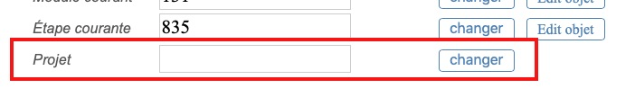

# Édition d'un icarien

Cette section `admin/icarien` permet d'éditer un icarien. Dans l'idée, on doit pouvoir, ici, modifier toutes ses informations.

## Modification d'une propriété

* Pour modifier une propriété, on commence par ajouter son champ dans le fichier `vues/icarien.erb` en utilisant la méthode `prop_form`. Si c'est une propriété "directe", c'est-à-dire une propriété que l'icarien possède dans son modèle, il suffit d'utiliser son nom, comme pour `:pseudo` ou `:icmodule_id`. En revanche, si c'est une autre propriété comme le nom du projet — qui est une propriété de son icmodule courant —, il faut s'y prendre autrement :
  * on définit un nom pertinent, par exemple `:project_name` pour le nom du projet ;
  * dans le fichier `lib/html_helpers.rb`, dans la constant `DATA_PROPS` qui définit les propriétés, on ajoute une ligne pour la propriété. Ici, le type est `String`, on a juste besoin d'un champ de texte pour éditer la propriété, donc on met :

  ~~~ruby
  DATA_PROPS = {
    ...
    project_name: {type:'text'}
  }
  ~~~

  Cela produit le champ text pour notre formulaire d'édition :

  

  À ce point, si le titre est défini, il n'est pas renseigné dans le champ. De la même manière, si l'on définit le titre dans le champ et que l'on clique le bouton « Changer », le titre ne sera pas enregistré. Il faut définir les méthodes qui vont permettre de le faire.

  * Pour pouvoir récupérer la valeur, on crée une méthode d'instance de `User` dans `lib/user.rb`, qui porte le nom de la propriété. Évidemment, cette méthode doit retourner la valeur de la propriété :

  ~~~ruby
  class User
    ...
    def project_name
      @projet_name ||= icmodule.project_name
    end
  end #/User
  ~~~

  * Pour pouvoir enregistrer la valeur avec le bouton « Change », on a deux solutions :
    * une méthode `User#set_<property>` (par exemple `User#set_project_name`)
    * une méthode `User#<property>=` (par exemple `User#project_name=`)

    Les deux méthodes sont à mettre dans le module `lib/user.rb`.
